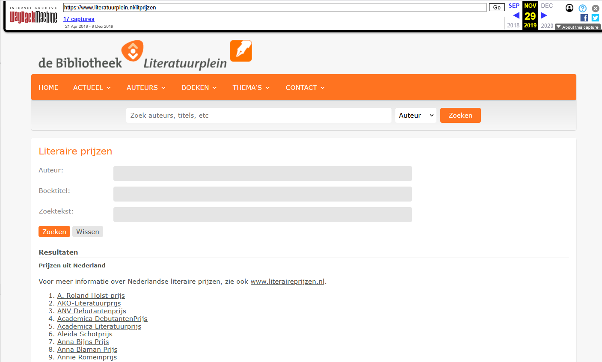
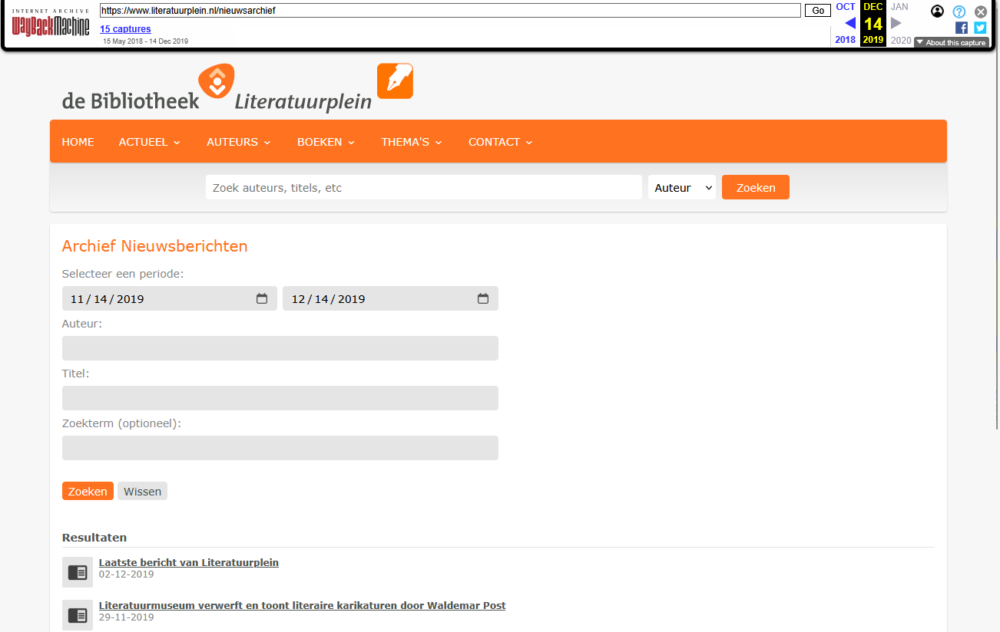

[← Back to Archived sites](../)

# Saving Literatuurplein.nl to the Wayback Machine

**[View on GitHub Pages](https://ookgezellig.github.io/SaveToWaybackMachine/archived-sites/Literatuurplein/)**

*Latest update: 22-04-2026*

## About

The site www.literatuurplein.nl has been phased out per 16 December 2019.

<br clear="all"/>
*Screenshot of homepage of Literatuurplein.nl, 04-12-2019* 

To preserve its content, e.g. for sourcing Wikipedia articles or (Wiki)data purposes, the KB submitted copies of (=archived) its most relevant pages to [The Wayback Machine](https://web.archive.org/) (WBM) of The Internet Archive during November and December 2019.

The results of this archiving effort are listed in the .xlsx and .tsv files that can be found using the table below.

## Wayback Machine screenshots

| Homepage | Thea Beckman | Literaire prijzen |
|:--------:|:------------:|:-----------------:|
|  |  |  |
| Screenshot of homepage, as archived in Wayback Machine on 25-11-2019 | Screenshot of Author detail page about Thea Beckman, as archived in Wayback Machine on 29-11-2019 | Screenshot of Overview of literary prizes, as archived in Wayback Machine on 29-11-2019 |

| Canon van de Nederlandse geschiedenis | Archief Nieuwsberichten | Recensies |
|:--------------------------------------:|:-----------------------:|:---------:|
|  |  |  |
| Screenshot of Canon van de Nederlandse geschiedenis, as archived in Wayback Machine on 28-11-2019 | Screenshot of Archief Nieuwsberichten, as archived in Wayback Machine on 14-12-2019 | Screenshot of Recensies page, as archived in Wayback Machine on 30-11-2019 |

## Data overview

Each Category contains a README with statistics about the data and download links to TSV and Excel files.

| Category | Description | Total URLs |
|----------------------------------------------------|-------------|------------|
| [personen](data/personen/README.md)                | Persons - mainly authors from the Netherlands, but also from abroad | 31.002 |
| [boeken](data/boeken/README.md)                    | Descriptions (metadata) of books. No explicit titles or authors provided | 16.677 |
| [nieuws](data/nieuws/README.md)                    | [Literary news archive](http://web.archive.org/web/20191129220520/https://www.literatuurplein.nl/nieuwsarchief) | 4.793 |
| [prijzen](data/prijzen/README.md)                  | [Literary awards](https://web.archive.org/web/20191129220242/https://www.literatuurplein.nl/litprijzen) in the Netherlands and Flanders | 4.622 |
| [adressenbank](data/adressenbank/README.md)        | [Names and addresses](https://web.archive.org/web/20191125105546/https://www.literatuurplein.nl/adressenbank) of literary organisations (publishers, book sellers, libraries, reading clubs etc.) | 3.464 |
| [canon](data/canon/README.md)                      | Book titles related to the 50 topics in the [canon of Dutch history](http://web.archive.org/web/20191128080343/https://www.literatuurplein.nl/canonoverzicht) | 3.006 |
| [recensies](data/recensies/README.md)              | [Reviews](http://web.archive.org/web/20191130191607/https:/www.literatuurplein.nl/recensies) of literary publications | 1.982 |
| [wereldkaart](data/wereldkaart/README.md)          | Book titles related to certain [locations on the world map](http://web.archive.org/web/20191130202911/https://www.literatuurplein.nl/wereldkaart) | 680 |
| [excursies](data/excursies/README.md)              | [Literary excursions](http://web.archive.org/web/20191129212445/https://www.literatuurplein.nl/excursies) to cities, towns and villages in the Netherlands and abroad | 464 |
| [trefwoorden](data/trefwoorden/README.md)          | Book titles related to certain keywords | 439 |
| [interviews](data/interviews/README.md)            | [Interviews](http://web.archive.org/web/20191129213127/https://www.literatuurplein.nl/interviews) with Dutch and foreign authors. Includes full-texts | 365 |
| [evenementen](data/evenementen/README.md)          | Events from the literary agenda | 247 |
| [leestips](data/leestips/README.md)                | [Reading tips](http://web.archive.org/web/20191129213154/https://www.literatuurplein.nl/leestips_overzicht) | 64 |
| [zoeken](data/zoeken/README.md)                    | Pages related to simple and advanced search | 51 |
| [poezie](data/poezie/README.md)                    | Profiles of 21 Dutch and Belgian [poets](http://web.archive.org/web/20191130174929/https://www.literatuurplein.nl/poezieoverzicht) | 44 |
| [genres](data/genres/README.md)                    | Book titles according to literary genre | 43 |
| [columns](data/columns/README.md)                  | [Literary columns](http://web.archive.org/web/20191128080421/https://www.literatuurplein.nl/columns) | 36 |
| [themas](data/themas/README.md)                    | Pages related to certain themes | 18 |
| [overige](data/overige/README.md)                  | Pages like Sitemap, Contact, Disclaimer, Colophon etc. | 16 |

## The data
* Every Excel file contains 4 standard columns:
  - *LiteratuurpleinURL* : URL of the page on literatuurplein.nl. As this site has been phased out by now, these URLs are not accessible anymore.
  - *LiteratuurpleinArchiefURL* : WBM URL of the archived page , starting with *http://web.archive.org/web/*
  - *ArchiefURLStatusCheck-datestamp* : [HTTP response status code](https://en.wikipedia.org/wiki/List_of_HTTP_status_codes) of the WBM page, indicating if that page could be requested without issues at the given datestamp. All pages should have Status 200 = OK.
  - *Klik* : Clicking on this will open the archived page in a browser.
* Additionaly, some Excels contain extra columns, including unique IDs, page titles, person names, places or dates.
* For every .xlsx there is a .tsv (tab separated value) in plain text Unicode UTF-8. This can be readily imported/exported to other data formats.
* One page can be available under multiple URLs. For example, if you look into *[literatuurplein-adressenbank_03122019.tsv](data/adressenbank/literatuurplein-adressenbank_03122019.tsv)* you see three lines for "55 Ambo/Anthos uitgevers, Herengracht 499, Amsterdam Noord-Holland", as this page was available under 3 distinct URLs:
  - `https://literatuurplein.nl/detail/organisatie/ambo-anthos-uitgevers/55`
  - `https://www.literatuurplein.nl/detail/organisatie/ambo-anthos-uitgevers/55`
  - `https://www.literatuurplein.nl/organisatie.jsp?orgId=55`

  Because I archived URLs, *not* pages, this also means that this page has been archived under three distinct WBM URLs.
* No overall file list is provided, you'll need to compose that yourself from the individual .xlsx/.tsv files if you need it.

## Short description per file
For readability the
1. prefix *literatuurplein-* , the
2. suffix *(_03122019)*, the datestamp when the file was created, and the
3. file extension (*.xlsx* / *.tsv*)
are omitted from the filenames below

The number behind the filename is the number of URLs captured (= number of rows in the Excel -1)

### Persons (`data/personen/`)
* *[personen-allen](data/personen/literatuurplein-personen-allen_19122019.tsv)* (19.404) : Persons - mainly authors from the Netherlands, but also from abroad.  *Without* dates of birth & death and places of birth & death. Persons can occur more than once (as I archived URLs, *not* pages)
* *[personen-namen-datums-plaatsen](data/personen/literatuurplein-personen-namen-datums-plaatsen_19122019.tsv)* (11.598) : Subset of *personen-allen* containing only named persons. Persons occur only once. Additionally in many cases the dates of birth & death and places of birth & death are listed. The plan is to merge all these persons into Wikidata in the near future.

### Literary prizes (`data/prijzen/`)
* *[prijzen](data/prijzen/literatuurplein-prijzen_06122019.tsv)* (243) : [Literary awards](https://web.archive.org/web/20191129220242/https://www.literatuurplein.nl/litprijzen) in the Netherlands and Flanders. Individual editions on these awards are listed in *prijzen-edities*.
* *[prijzen-edities](data/prijzen/literatuurplein-prijzen-edities_06122019.tsv)* (2.347) : Editions of literay awards in the Netherlands and Flanders.
* *[prijzen-totaal](data/prijzen/literatuurplein-prijzen-totaal_17122019.tsv)* (2.032) : Combined deduplicated listing of both awards and editions.

### Books (`data/boeken/`, `data/canon/`, `data/wereldkaart/`, `data/trefwoorden/`, `data/genres/`)
* *[boeken](data/boeken/literatuurplein-boeken_06122019.tsv)* (16.677) : Descritions (metadata) of books. No explicit titles of authors provided.
* *[canon](data/canon/literatuurplein-canon_28112019.tsv)* (3.006) : Book titles related to the 50 topics in the [canon of Dutch history](http://web.archive.org/web/20191128080343/https://www.literatuurplein.nl/canonoverzicht).
* *[wereldkaart](data/wereldkaart/literatuurplein-wereldkaart_06122019.tsv)* (680) : Books titles related to certain [locations on the world map](http://web.archive.org/web/20191130202911/https://www.literatuurplein.nl/wereldkaart).
* *[trefwoorden](data/trefwoorden/literatuurplein-trefwoorden_06122019.tsv)* (439) : Books titles related to certain keywords.
* *[genres](data/genres/literatuurplein-genres_06122019.tsv)* (43) : Book titles according to literary genre.

### Other content
* *[nieuws](data/nieuws/literatuurplein-nieuws_06122019.tsv)* (4.793) : [Literary news archive](http://web.archive.org/web/20191129220520/https://www.literatuurplein.nl/nieuwsarchief).
* *[adressenbank](data/adressenbank/literatuurplein-adressenbank_03122019.tsv)* (3.464) : [Names and adresses](https://web.archive.org/web/20191125105546/https://www.literatuurplein.nl/adressenbank) of literary organisations (publishers, book sellers, libraries, reading clubs etc.). Mainly in the Netherlands, sortable by province. Some in Belgium and Europe.
* *[recensies](data/recensies/literatuurplein-recensies_28112019.tsv)* (1.982) : [Reviews](http://web.archive.org/web/20191130191607/https:/www.literatuurplein.nl/recensies) of literary publications.
* *[excursies](data/excursies/literatuurplein-excursies_28112019.tsv)* (464) : [Literary excursions](http://web.archive.org/web/20191129212445/https://www.literatuurplein.nl/excursies) to cities, towns and villages in the Netherlands and abroad.
* *[interviews](data/interviews/literatuurplein-interviews_28112019.tsv)* (364) : [Interviews](http://web.archive.org/web/20191129213127/https://www.literatuurplein.nl/interviews) with Dutch and foreign authors. Inludes full-texts of the interviews.
* *[evenementen](data/evenementen/literatuurplein-evenementen_06122019.tsv)* (247) : Events from the literary agenda.
* *[leestips](data/leestips/literatuurplein-leestips_06122019.tsv)* (64) : [Reading tips](http://web.archive.org/web/20191129213154/https://www.literatuurplein.nl/leestips_overzicht).
* *[poezie](data/poezie/literatuurplein-poezie_29112019.tsv)* (44) : Profiles of 21 Dutch and Belgium [poets](http://web.archive.org/web/20191130174929/https://www.literatuurplein.nl/poezieoverzicht)
* *[columns](data/columns/literatuurplein-columns_06122019.tsv)* (36) : [Literary columns](http://web.archive.org/web/20191128080421/https://www.literatuurplein.nl/columns).
* *[themas](data/themas/literatuurplein-themas_06122019.tsv)* (18) : Pages related to certain themes.
* *[zoeken](data/zoeken/literatuurplein-zoeken_06122019.tsv)* (51) : Pages related to simple and advanced search.
* *[overige](data/overige/literatuurplein-overige_06122019.tsv)* (16) : Pages like Sitemap, Contact, Disclaimer, Colophon etc.

Obviously, more Literatuurplein URLs than are listed here are (likely to be) available in the WBM. This is because apart from the *active* archiving effort I've conducted, the WMB crawler/archiver has visited the site over its lifetime, thus archiving pages for many years (*passive* archiving).

## Data sources
The data to make the above files was obtained from 3 sources:

1) *Most relevant subsites* of [www.literatuurplein.nl](https://web.archive.org/web/20191125105524/https://www.literatuurplein.nl/) : Page URLs and page content under the menu items *Nieuws - Columns - Interviews - Literaire prijzen - Recensies - Canon - Excursies - Poezie - Literaire adressen*, obtained via webscraping.
2) *Most visited pages* : URLs of pages that were requested 30 or more times over the last 5 years, obtained via Google Analytics.
3) *Persons data* : A data dump from the Literatuurplein CMS, containing the names, dates of birth & death and places of birth & death of 10.027 persons (mainly authors).

## Steps taken
1) For webscraping source 1 I used the [Chrome-plugin](https://chrome.google.com/webstore/detail/web-scraper/jnhgnonknehpejjnehehllkliplmbmhn?hl=en) of [Webscraper.io](https://webscraper.io/). With this tool you can specify which page URLs and HTML-elements (title, headers, bullet lists etc) you want to extract from a website. The result can be downloaded as a csv file for futher processing in Excel.

2) To get the URLs of the most visited pages (source 2), I used Google Analytics. This were 32K URLs in total, out of a total of 964K URLs that were requested in that time period (extreme long tail distribution).

3) In the [data dump](archive/literatuurplein-personen-oorspronkelijk_SophieHam_07112019.csv) (source 3) I transfomed the ID in column 1 (e.g. 161934) into a Leesplein URL (https://www.literatuurplein.nl/persdetail?persId=161934). This data dump ended up in *[personen-allen](data/personen/literatuurplein-personen-allen_19122019.tsv)* and *[personen-namen-datums-plaatsen](data/personen/literatuurplein-personen-namen-datums-plaatsen_19122019.tsv)*

4) I combined these three lists of URLs into a single list and did some deduplication (using Excel) to avoid any overlap, as the three sources are not necessarily disjunct.

5) Using a url-status-checker script I checked if all the Literatuurplein URLs actually worked (= status 200). This took many hours. I deleted the URLs giving 404s or other errors.

6) Once all the preparations were done, it was now time to actually archive all URLs to the Wayback Machine. For that I ran a Python script using [waybackpy](https://pypi.org/project/waybackpy/). This was not a 100% process, some URLs could not be captured correctly by the WBM and were thus omitted from further processing. See `../../scripts/wbm-archiver/` for current archiving scripts.

7) To make sure all generated WBM URLs actually work, I again ran the url-status-checker script, but now with the archived URLs as input. Once again this took many hours. I deleted the URLs giving 404s or other errors.

8) For improved overview I split up URLs list into 22 Excels, according to the file listing above.

9) I converted all Excels into open .tsv (tab separated value) files in plain text Unicode UTF-8. These can be readily imported/exported to other data formats.


## Folder structure

```
Literatuurplein/
├── index.md                     # This page
├── README.md                    # Mirror of index.md
├── images/                      # Screenshots of the website in the WBM
└── data/                        # Archived URL data files organized by category
    ├── adressenbank/            # Literary organisations (3.464 URLs)
    ├── boeken/                  # Book metadata (16.677 URLs)
    ├── canon/                   # Canon of Dutch history books (3.006 URLs)
    ├── columns/                 # Literary columns (36 URLs)
    ├── evenementen/             # Literary events (247 URLs)
    ├── excursies/               # Literary excursions (464 URLs)
    ├── genres/                  # Books by genre (43 URLs)
    ├── interviews/              # Author interviews (365 URLs)
    ├── leestips/                # Reading tips (64 URLs)
    ├── nieuws/                  # Literary news (4.793 URLs)
    ├── overige/                 # Misc pages (16 URLs)
    ├── personen/                # Person/author data (31.002 URLs)
    ├── poezie/                  # Poet profiles (44 URLs)
    ├── prijzen/                 # Literary awards (4.622 URLs)
    ├── recensies/               # Book reviews (1.982 URLs)
    ├── themas/                  # Themed pages (18 URLs)
    ├── trefwoorden/             # Books by keyword (439 URLs)
    ├── wereldkaart/             # Books by world location (680 URLs)
    └── zoeken/                  # Search pages (51 URLs)
```

## Related projects

- [Wikidata:WikiProject Dutch Literary Awards](https://www.wikidata.org/wiki/Wikidata:WikiProject_Dutch_Literary_Awards) - Uses data from this archive
- [KB GLAM Wikidata projects](https://www.wikidata.org/wiki/Wikidata:GLAM/Koninklijke_Bibliotheek_Nederland) - Broader context
