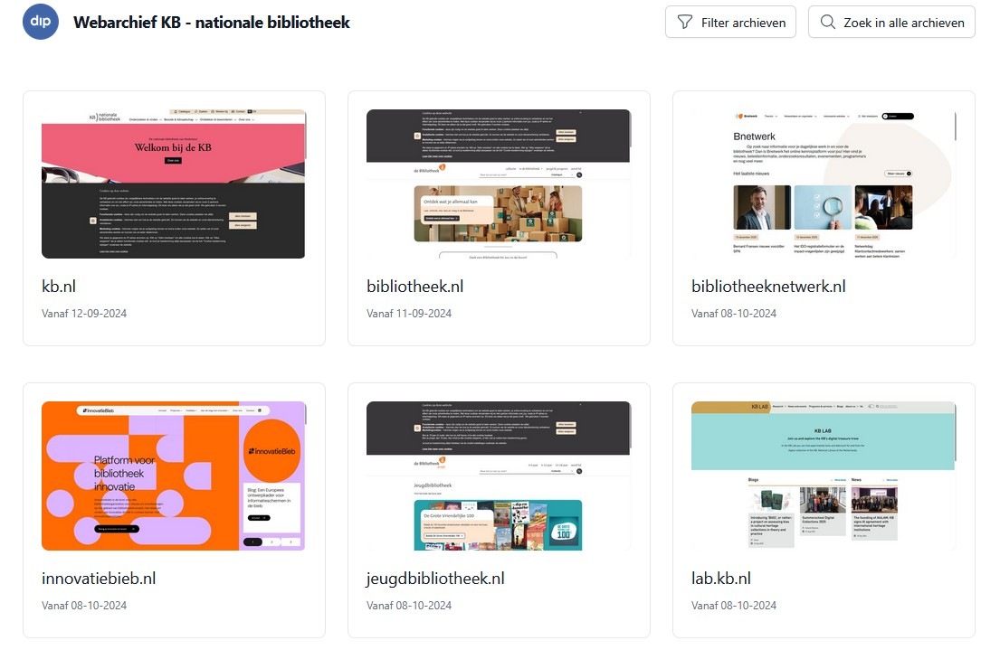

[← Back to Home](../)

# Archived sites

Browse all websites that the KB, national library of the Netherlands, archived into to the Wayback Machine.

  <a href="mmdc.nl/" class="nav-card">
    
    <h3>mmdc.nl</h3>
    
Medieval Manuscripts in Dutch Collections - 12.204 URLs archived

    Dec 2025 & April 2026
  </a>
  <a href="kb.nl/" class="nav-card">
    
    <h3>kb.nl</h3>
    
KB website archives - 5.720 & 1.915 URLs archived

    Dec 2021 & Mar 2022
  </a>
  <a href="Literatuurgeschiedenis.org/" class="nav-card">
    
    <h3>Literatuurgeschiedenis.org</h3>
    
Literary history - 464 URLs archived

    Mar 2022
  </a>
  <a href="Literatuurplein/" class="nav-card">
    
    <h3>Literatuurplein.nl</h3>
    
Comprehensive literary portal - 69.599 URLs archived

    Dec 2019
  </a>
  <a href="GidsVoorNederland/" class="nav-card">
    
    <h3>GidsVoorNederland.nl</h3>
    
Library section - 1.300 URLs archived

    Nov 2018
  </a>
  <a href="Literaireprijzen.nl/" class="nav-card">
    
    <h3>Literaireprijzen.nl</h3>
    
Literary prizes - 452 URLs archived

    Oct 2018
  </a>
  <a href="LezenVoorDeLijst/" class="nav-card">
    
    <h3>LezenVoorDeLijst.nl</h3>
    
Reading list portal - 12.456 URLs archived

    Aug 2018
  </a>
  <a href="Leesplein/" class="nav-card">
    
    <h3>Leesplein.nl</h3>
    
Children's reading portal - 23.784 URLs archived

    Jun 2018
  </a>

## Quick reference

| Site                                                                                              | Archive date | # URLs | Link to dataset (.tsv, .txt, .xlsx)                                                                                                                                                                                                             
|---------------------------------------------------------------------------------------------------|---------------|--------|-------------------------------------------------------------------------------------------------------------------------------------------------------------------------------------------------------------------------------------------------|
| [Medieval Manuscripts in Dutch Collections (catalog records)](archived-sites/mmdc.nl/index.md)    | Apr 2026      | 11.738 | [Excel file](archived-sites/mmdc.nl/mmdc-urls-unified_15042026.xlsx) (sheets *catalog-pages* and *catalog-pages-full-metadata*)                                                                                                                 |
| [Medieval Manuscripts in Dutch Collections (static pages, PDFs, assets)](archived-sites/mmdc.nl/) | Dec 2025      | 466    | [Excel file](archived-sites/mmdc.nl/mmdc-urls-unified_15042026.xlsx) (sheet *non-catalog-pages*)                                                                                                                                                |
| [kb.nl (new)](archived-sites/kb.nl/)                                                              | Mar 2022      | 1.915  | [Excel file](archived-sites/kb.nl/23032022/urls_kbnl_archivedwbm_23032022.xlsx) and  [CSV](archived-sites/kb.nl/23032022/urls_kbnl_archivedwbm_23032022.csv)                                                                                    |
| [Literatuurgeschiedenis.org](archived-sites/Literatuurgeschiedenis.org/)                          | Mar 2022      | 465   | [Excel file](archived-sites/Literatuurgeschiedenis.org/25032022/urls_literatuurgeschiedenisorg_archivedwbm_25032022.xlsx) and [CSV](archived-sites/Literatuurgeschiedenis.org/25032022/urls_literatuurgeschiedenisorg_archivedwbm_25032022.csv) |
| [kb.nl (old)](archived-sites/kb.nl/)                                                              | Dec 2021      | 5.720  | [Excel file](archived-sites/kb.nl/24122021/urls_kbnl_archivedwbm_24122021.xlsx) and  [CSV](archived-sites/kb.nl/24122021/urls_kbnl_archivedwbm_24122021.csv)                                                                                    |
| [Literatuurplein.nl](archived-sites/Literatuurplein/)                                             | Dec 2019      | 69.599 | See this [Data overview](archived-sites/Literatuurplein/index.md#data-overview)                                                                                                                                                                 |
| [Gidsvoornederland.nl](archived-sites/GidsVoorNederland/)                                         | Nov 2018      | 1.300  | [TXT](archived-sites/GidsVoorNederland/Output-Gids_GearchiveerdeURLs_11112018_masterfile.txt)                                                                                                                                                   |
| [Literaireprijzen.nl](archived-sites/Literaireprijzen.nl/)                                        | Oct 2018      | 452    | [TXT](archived-sites/Literaireprijzen.nl/Output-Lprijzen_GearchiveerdeURLs_31102018_masterfile.txt)                                                                                                                                             |
| [Lezenvoordelijst.nl](archived-sites/LezenVoorDeLijst/)                                           | Aug 2018      | 12.456 | [TXT](archived-sites/LezenVoorDeLijst/Output-LvdL_GearchiveerdeURLs_17082018_masterfile.txt)                                                                                                                                                    |
| [Leesplein.nl](archived-sites/Leesplein/)                                                         | Jun 2018      | 23.785 | [TXT](archived-sites/Leesplein/Output-Leesplein_GearchiveerdeURLs_14062018_masterfile.txt)

## KB's own web archive
For websites archived in KB's own web archive, see https://kb.webarchief.online/. 

