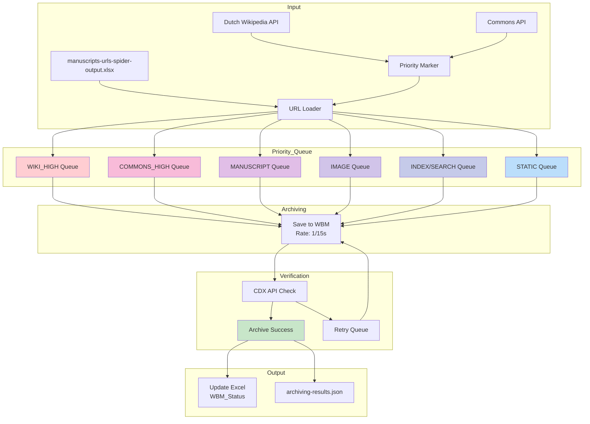
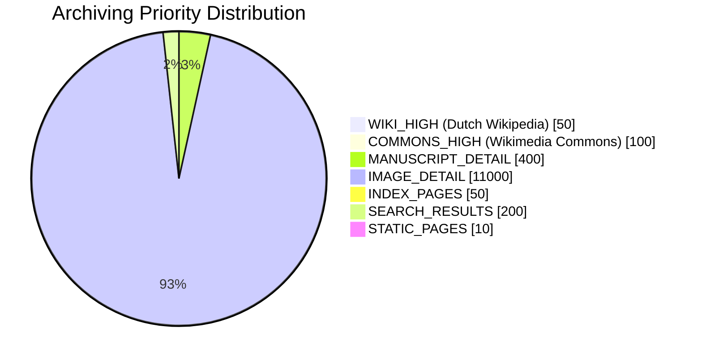

# Wayback Machine Archiving Plan: manuscripts.kb.nl
## Priority-Based Archiving with Wikimedia Focus

**Status:** DRAFT - Ready for Implementation
**Created:** 2025-12-10
**Agent:** Claude Code (Opus 4.5)
**Target:** https://manuscripts.kb.nl/
**Deadline:** December 15, 2025 (site shutdown)

---

## Visual Overview

```mermaid
gantt
    title manuscripts.kb.nl WBM Archiving - Timeline
    dateFormat  HH:mm
    axisFormat %H:%M

    section Phase 1: Preparation
    Fetch Dutch Wikipedia URLs    :p1a, 00:00, 20m
    Fetch Commons URLs            :p1b, 00:00, 20m
    Mark priority in Excel        :p1c, after p1b, 10m
    Create archiving scripts      :p1d, after p1c, 30m

    section Phase 2: Priority Archiving
    Archive WIKI_HIGH URLs        :p2a, after p1d, 60m
    Archive COMMONS_HIGH URLs     :p2b, after p2a, 30m
    Verify CDX for priority URLs  :p2c, after p2b, 15m

    section Phase 3: Detail Pages
    Archive MANUSCRIPT_DETAIL     :p3a, after p2c, 120m
    Archive IMAGE_DETAIL (batch1) :p3b, after p3a, 180m
    Archive IMAGE_DETAIL (batch2) :p3c, after p3b, 180m
    Archive IMAGE_DETAIL (batch3) :p3d, after p3c, 180m

    section Phase 4: Support Pages
    Archive INDEX_PAGES           :p4a, after p3d, 30m
    Archive SEARCH_RESULTS        :p4b, after p4a, 60m
    Archive STATIC_PAGES          :p4c, after p4b, 15m

    section Phase 5: Verification
    CDX verification all URLs     :p5a, after p4c, 60m
    Update Excel with WBM URLs    :p5b, after p5a, 30m
    Generate final report         :p5c, after p5b, 15m
```







---

## Executive Summary

This plan outlines the Wayback Machine archiving strategy for manuscripts.kb.nl with **Wikipedia/Commons URLs prioritized first** to ensure these critical cultural heritage links remain functional.

**Key principles:**
1. **Wiki Priority First:** URLs linked from Dutch Wikipedia and Wikimedia Commons are archived first
2. **Rate Limiting:** 1 request per 15 seconds to avoid WBM rate limits
3. **Resume Capability:** Checkpoint-based progress tracking
4. **Verification:** CDX API checks to confirm successful archiving

---

## 1. Priority System

### Priority Levels (Archiving Order)

| Priority | Description | Expected Count | Archive Order |
|----------|-------------|----------------|---------------|
| **WIKI_HIGH** | Linked from Dutch Wikipedia (main namespace) | ~50 | 1st |
| **COMMONS_HIGH** | Linked from Wikimedia Commons (File namespace) | ~100 | 2nd |
| **MANUSCRIPT** | Manuscript detail pages | ~400 | 3rd |
| **IMAGE** | Image detail pages | ~11,000 | 4th |
| **INDEX** | Index/navigation pages | ~50 | 5th |
| **SEARCH** | Search result pages | ~200 | 6th |
| **STATIC** | Static content pages | ~10 | 7th |

### Why Wiki Priority Matters

URLs linked from Wikipedia and Wikimedia Commons are:
- **Referenced in encyclopedic articles** that millions of people read
- **Used as sources in File descriptions** on Commons
- **Critical for Wikimedia's verifiability policy**
- **Breaking links damages Wikipedia's credibility**

---

## 2. Wikimedia URL Discovery

### Dutch Wikipedia API

```python
# Fetch URLs linked from Dutch Wikipedia
API_URL = "https://nl.wikipedia.org/w/api.php"
params = {
    "action": "query",
    "list": "exturlusage",
    "euquery": "manuscripts.kb.nl",
    "eulimit": "500",
    "eunamespace": "0",  # Main namespace only
    "format": "json"
}
```

**Web Interface:** https://nl.wikipedia.org/w/index.php?title=Speciaal:VerwijzingenZoeken&limit=500&offset=0&target=manuscripts.kb.nl

### Wikimedia Commons API

```python
# Fetch URLs linked from Wikimedia Commons
API_URL = "https://commons.wikimedia.org/w/api.php"
params = {
    "action": "query",
    "list": "exturlusage",
    "euquery": "manuscripts.kb.nl",
    "eulimit": "500",
    "eunamespace": "6",  # File namespace only
    "format": "json"
}
```

**Web Interface:** https://commons.wikimedia.org/w/index.php?title=Special:LinkSearch&limit=500&offset=0&target=manuscripts.kb.nl

---

## 3. Archiving Strategy

### WBM Save API

```python
SAVE_URL = "https://web.archive.org/save/{url}"

# Request headers
headers = {
    "User-Agent": "Mozilla/5.0 (compatible; KB-Archiver/1.0; +https://www.kb.nl/)",
    "Accept": "application/json",
}

# Optional: Authenticated requests (higher limits)
# Use S3 access keys from archive.org account
```

### Rate Limiting

| Method | Rate Limit | Notes |
|--------|------------|-------|
| Anonymous | ~5 per minute | Basic, no auth |
| Logged in (browser) | ~15 per minute | Manual archiving |
| **API with S3 keys** | **~60 per minute** | **Recommended** |

**Recommended approach:** Use authenticated requests with S3 keys for higher throughput.

### Retry Strategy

| Condition | Action | Max Retries |
|-----------|--------|-------------|
| HTTP 429 (rate limit) | Wait 60s, then retry | 3 |
| HTTP 523 (origin unreachable) | Wait 30s, retry | 2 |
| HTTP 500/502/503 | Wait 30s, retry | 2 |
| Timeout | Increase timeout, retry | 2 |
| Success | Mark as archived | - |
| Final failure | Log error, continue | - |

---

## 4. Implementation Phases

### Phase 1: Preparation (30-60 min)

| Step | Task | Output |
|------|------|--------|
| 1.1 | Fetch Dutch Wikipedia external links | `wiki_priority_urls.json` |
| 1.2 | Fetch Commons external links | `commons_priority_urls.json` |
| 1.3 | Mark priority URLs in Excel | Updated `manuscripts-urls-spider-output.xlsx` |
| 1.4 | Create archiving script | `archive_to_wbm.py` |
| 1.5 | Test with 5 URLs | Verify WBM save works |

### Phase 2: Priority Archiving (1-2 hours)

| Step | Task | Expected URLs | Est. Time |
|------|------|---------------|-----------|
| 2.1 | Archive WIKI_HIGH URLs | ~50 | 15 min |
| 2.2 | Archive COMMONS_HIGH URLs | ~100 | 30 min |
| 2.3 | Verify with CDX API | All priority URLs | 15 min |

### Phase 3: Detail Page Archiving (8-12 hours)

| Step | Task | Expected URLs | Est. Time |
|------|------|---------------|-----------|
| 3.1 | Archive MANUSCRIPT_DETAIL | ~400 | 2 hours |
| 3.2 | Archive IMAGE_DETAIL (batch 1) | ~3,700 | 3 hours |
| 3.3 | Archive IMAGE_DETAIL (batch 2) | ~3,700 | 3 hours |
| 3.4 | Archive IMAGE_DETAIL (batch 3) | ~3,700 | 3 hours |

**Note:** IMAGE_DETAIL is the largest category. Split into batches for checkpoint recovery.

### Phase 4: Support Pages (1-2 hours)

| Step | Task | Expected URLs | Est. Time |
|------|------|---------------|-----------|
| 4.1 | Archive INDEX_PAGES | ~50 | 15 min |
| 4.2 | Archive SEARCH_RESULTS | ~200 | 45 min |
| 4.3 | Archive STATIC_PAGES | ~10 | 5 min |

### Phase 5: Verification (1-2 hours)

| Step | Task | Output |
|------|------|--------|
| 5.1 | CDX API verification for all URLs | Status report |
| 5.2 | Update Excel with WBM URLs | Final Excel |
| 5.3 | Generate archiving report | `archiving-report.md` |
| 5.4 | Retry failed URLs | Second pass |

---

## 5. File Structure

```
archived-sites/manuscripts.kb.nl/
├── manuscripts-urls-spider-output.xlsx     # Master URL list with WBM status
├── _spider-artifacts/                # Spider output
│   └── (crawl files)
└── _archiving-artifacts/
    ├── docs/
    │   ├── PLAN-wbm-archiving-manuscripts.kb.nl.md  # This plan
    │   └── archiving-report.md                       # Final report
    ├── scripts/
    │   ├── requirements.txt
    │   ├── fetch_wiki_priority.py    # Fetch Wikipedia/Commons URLs
    │   ├── archive_to_wbm.py         # Main archiving script
    │   ├── verify_cdx.py             # CDX verification
    │   └── update_excel.py           # Update Excel with WBM URLs
    ├── data/
    │   ├── wiki_priority_urls.json   # URLs from Dutch Wikipedia
    │   ├── commons_priority_urls.json # URLs from Wikimedia Commons
    │   ├── archiving-progress.json   # Checkpoint file
    │   └── archiving-results.json    # Final results
    └── logs/
        ├── archiving.log             # Main log
        └── errors.log                # Error log
```

---

## 6. Excel Update Strategy

### During Archiving

Update Excel in batches of 50 URLs:

| Column | Update |
|--------|--------|
| WBM_Status | `archived` / `failed` / `pending` |
| WBM_URL | `https://web.archive.org/web/{timestamp}/{url}` |
| WBM_Timestamp | `YYYYMMDDHHmmss` format |

### CDX Verification

```python
CDX_URL = f"https://web.archive.org/cdx/search/cdx?url={encoded_url}&output=json&from=20251201"
```

---

## 7. Monitoring & Progress

### Progress Tracking

```json
{
  "started": "2025-12-10T18:00:00",
  "total_urls": 12300,
  "processed": 5000,
  "successful": 4950,
  "failed": 50,
  "current_batch": "IMAGE_DETAIL",
  "current_index": 1234,
  "last_checkpoint": "2025-12-10T20:30:00"
}
```

### Console Output

```
[12:30:45] Archiving WIKI_HIGH (50 URLs)...
[12:30:46] OK: https://manuscripts.kb.nl/show/manuscript/76+F+5
[12:30:48] OK: https://manuscripts.kb.nl/show/image/76+F+5/023V
[12:45:00] === WIKI_HIGH complete: 50/50 (100%) ===
[12:45:01] Starting COMMONS_HIGH (100 URLs)...
```

---

## 8. Error Handling

### Common Errors

| Error | Cause | Solution |
|-------|-------|----------|
| 429 Too Many Requests | Rate limit exceeded | Wait 60s, reduce rate |
| 523 Origin Unreachable | Site offline | Try later, use cache |
| Timeout | Slow response | Increase timeout |
| Invalid URL | Malformed URL | Skip, log error |

### Failed URL Recovery

After main archiving completes:
1. Extract failed URLs from `archiving-results.json`
2. Wait 1 hour for WBM queues to clear
3. Retry failed URLs with longer delays
4. If still failing, mark as permanent failure

---

## 9. Success Criteria

### Minimum Requirements

- [ ] All WIKI_HIGH URLs archived (100%)
- [ ] All COMMONS_HIGH URLs archived (100%)
- [ ] At least 95% of MANUSCRIPT_DETAIL archived
- [ ] At least 90% of IMAGE_DETAIL archived
- [ ] Excel updated with all WBM URLs
- [ ] CDX verification confirms archival

### Target Goals

- [ ] 100% of all URLs archived
- [ ] Zero failed URLs in priority categories
- [ ] All Wikipedia/Commons links functional
- [ ] Complete before December 15, 2025 deadline

---

## 10. Implementation Checklist

### Phase 1: Preparation
- [ ] 1.1 Create `fetch_wiki_priority.py`
- [ ] 1.2 Run Wiki priority fetch
- [ ] 1.3 Run Commons priority fetch
- [ ] 1.4 Update Excel with priority markers
- [ ] 1.5 Create `archive_to_wbm.py`
- [ ] 1.6 Test with 5 URLs

### Phase 2: Priority Archiving
- [ ] 2.1 Archive all WIKI_HIGH URLs
- [ ] 2.2 Archive all COMMONS_HIGH URLs
- [ ] 2.3 CDX verify priority URLs

### Phase 3: Detail Pages
- [ ] 3.1 Archive MANUSCRIPT_DETAIL (~400)
- [ ] 3.2 Archive IMAGE_DETAIL batch 1
- [ ] 3.3 Archive IMAGE_DETAIL batch 2
- [ ] 3.4 Archive IMAGE_DETAIL batch 3

### Phase 4: Support Pages
- [ ] 4.1 Archive INDEX_PAGES
- [ ] 4.2 Archive SEARCH_RESULTS
- [ ] 4.3 Archive STATIC_PAGES

### Phase 5: Verification
- [ ] 5.1 CDX verify all URLs
- [ ] 5.2 Update Excel with WBM URLs
- [ ] 5.3 Retry failed URLs
- [ ] 5.4 Generate final report

---

## 11. Time Estimates

| Category | URLs | Rate (per min) | Est. Time |
|----------|------|----------------|-----------|
| WIKI_HIGH | 50 | 4 | 15 min |
| COMMONS_HIGH | 100 | 4 | 25 min |
| MANUSCRIPT | 400 | 4 | 1.5 hours |
| IMAGE | 11,000 | 4 | 45 hours |
| INDEX | 50 | 4 | 15 min |
| SEARCH | 200 | 4 | 50 min |
| STATIC | 10 | 4 | 3 min |
| **Total** | **~12,000** | - | **~50 hours** |

**Note:** With authenticated API access (higher rate limits), this could be reduced to ~20 hours.

---

## 12. Quick Start Commands

```bash
# 1. Navigate to archiving directory
cd D:\KB-OPEN\github-repos\SaveToWaybackMachine\archived-sites\manuscripts.kb.nl\_archiving-artifacts\scripts

# 2. Install dependencies
pip install -r requirements.txt

# 3. Fetch Wikipedia priority URLs
python fetch_wiki_priority.py

# 4. Run archiving (priority first)
python archive_to_wbm.py --priority-first

# 5. Check progress
python verify_cdx.py --status

# 6. Update Excel with results
python update_excel.py
```

---

*Plan created: 2025-12-10*
*Status: DRAFT - Ready for Implementation*
