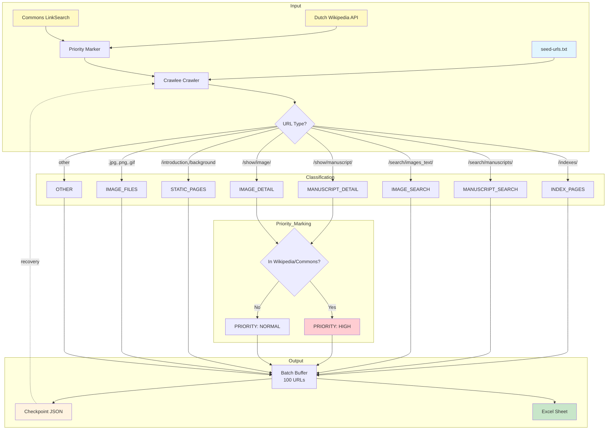
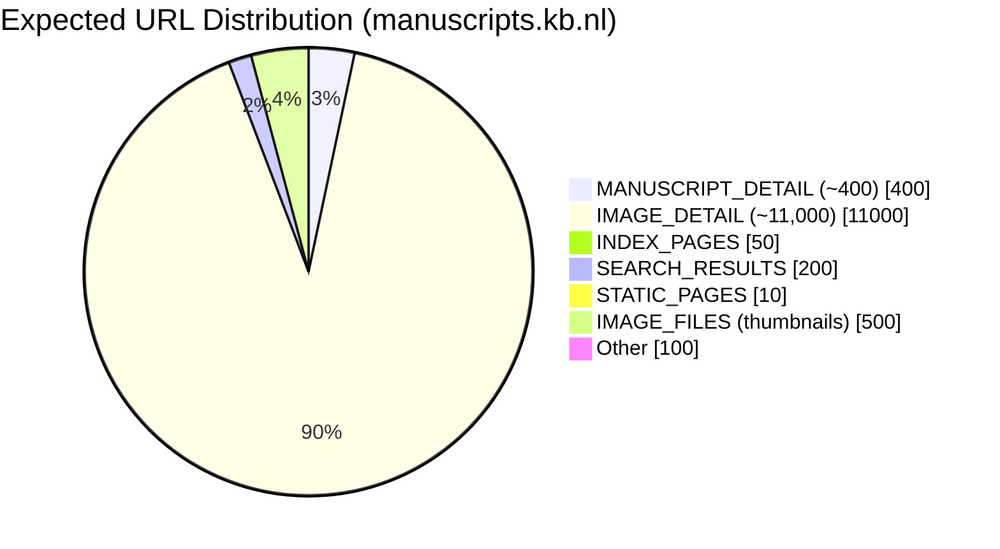
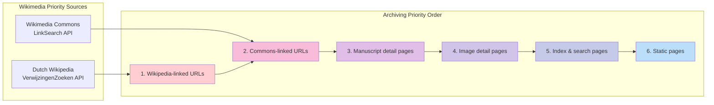

# URL Spider Plan: manuscripts.kb.nl
## Complete URL Discovery for Medieval Illuminated Manuscripts (MVH)

**Status:** APPROVED - Ready for Implementation
**Created:** 2025-12-10
**Agent:** Claude Code (Opus 4.5)
**Target:** https://manuscripts.kb.nl/
**Deadline:** December 15, 2025 (site shutdown)

---

## Visual Overview

```mermaid
gantt
    title manuscripts.kb.nl URL Spider - Implementation Timeline
    dateFormat  HH:mm
    axisFormat %H:%M

    section Phase 1: Setup
    Create folder structure       :p1a, 00:00, 10m
    Install dependencies          :p1b, after p1a, 10m
    Probe crawl (20 URLs)        :p1c, after p1b, 15m
    Initialize Excel             :p1d, after p1c, 5m

    section Phase 2: Wiki Priority
    Fetch Dutch Wikipedia links  :p2a, after p1d, 20m
    Fetch Commons links          :p2b, after p1d, 20m
    Mark priority URLs           :p2c, after p2b, 10m

    section Phase 3: Manuscript Index
    Crawl shelfmark index        :p3a, after p2c, 30m
    Crawl authortitle index      :p3b, after p3a, 30m
    Crawl place/language index   :p3c, after p3b, 20m
    Extract ~400 manuscript URLs :p3d, after p3c, 30m

    section Phase 4: Image Index
    Crawl titleImage index       :p4a, after p3d, 60m
    Crawl iconclass index        :p4b, after p4a, 60m
    Crawl haspart/imagetype      :p4c, after p4b, 30m
    Extract ~11,000 image URLs   :p4d, after p4c, 90m

    section Phase 5: Static Pages
    Crawl introduction/background:p5a, after p4d, 15m
    Crawl advanced search        :p5b, after p5a, 10m
    Discover linked pages        :p5c, after p5b, 30m

    section Phase 6: Verify
    Deduplicate Excel            :p6a, after p5c, 10m
    Count & validate URLs        :p6b, after p6a, 10m
    Generate summary report      :p6c, after p6b, 10m
```









---

## Executive Summary

This plan outlines the complete URL discovery strategy for manuscripts.kb.nl (Medieval Illuminated Manuscripts / Middeleeuwse Verluchte Handschriften - MVH) before the December 15, 2025 shutdown.

**Key characteristics:**
- ~400 manuscripts (set BYVANCK)
- ~11,141 images (set ByvanckB)
- Index-based navigation (shelfmark, authortitle, place, language, iconclass, etc.)
- Paginated search results

**Priority system:** URLs linked from Dutch Wikipedia and Wikimedia Commons get highest archiving priority.

---

## 1. Site Structure Analysis

Based on the seed URLs, the site has the following structure:

### Entry Points
| URL Pattern | Description | Expected Count |
|-------------|-------------|----------------|
| `/` | Homepage | 1 |
| `/advanced` | Advanced search | 1 |
| `/introduction` | Introduction page | 1 |
| `/background` | Background information | 1 |

### Index Pages (Navigation Hubs)
| Index | URL | Content |
|-------|-----|---------|
| Shelfmark | `/indexes/shelfmark` | Manuscript by call number |
| Author/Title | `/indexes/authortitle` | Manuscript by author/title |
| Place | `/indexes/place` | Manuscript by origin place |
| Language | `/indexes/language` | Manuscript by language |
| Title Image | `/indexes/titleImage` | Images by title |
| Iconclass | `/indexes/iconclass` | Images by Iconclass code |
| Has Part | `/indexes/haspart` | Image components |
| Image Type | `/indexes/imagetype` | Image by type |
| Miniaturist | `/indexes/miniaturist` | Images by artist |

### Search Result Pages
| Pattern | Description |
|---------|-------------|
| `/search/manuscripts/extended/shelfmark/*` | Manuscript search results |
| `/search/manuscripts/extended/page/N/shelfmark/%2A` | Paginated results |
| `/search/images_text/extended/titleImage/*` | Image search results |
| `/search/images_text/extended/page/N/titleImage/%2A` | Paginated image results |

### Detail Pages (Main Content)
| Pattern | Description | Expected Count |
|---------|-------------|----------------|
| `/show/manuscript/[id]` | Individual manuscript page | ~400 |
| `/show/image/[id]` | Individual image page | ~11,141 |

---

## 2. Wikimedia Priority Integration

### Dutch Wikipedia Links

**API Endpoint:**
```
https://nl.wikipedia.org/w/api.php?action=query&list=exturlusage&euquery=manuscripts.kb.nl&eulimit=500&eunamespace=0&format=json
```

### Wikimedia Commons Links

**API Endpoint:**
```
https://commons.wikimedia.org/w/api.php?action=query&list=exturlusage&euquery=manuscripts.kb.nl&eulimit=500&eunamespace=6&format=json
```

### Priority Marking Logic

```python
def mark_priority(url: str, wiki_urls: set, commons_urls: set) -> str:
    """Determine archiving priority based on Wikimedia presence."""
    if url in wiki_urls:
        return "WIKI_HIGH"  # Linked from Dutch Wikipedia
    elif url in commons_urls:
        return "COMMONS_HIGH"  # Linked from Wikimedia Commons
    elif '/show/manuscript/' in url:
        return "MANUSCRIPT"  # Manuscript detail page
    elif '/show/image/' in url:
        return "IMAGE"  # Image detail page
    else:
        return "NORMAL"
```

---

## 3. URL Classification Logic

```python
from urllib.parse import urlparse

def classify_url(url: str) -> str:
    """Classify URL into functional group (sheet name)."""
    path = urlparse(url).path.lower()

    # Index pages
    if '/indexes/' in path:
        return "INDEX_PAGES"

    # Search results - manuscripts
    elif '/search/manuscripts/' in path:
        return "MANUSCRIPT_SEARCH"

    # Search results - images
    elif '/search/images_text/' in path or '/search/images/' in path:
        return "IMAGE_SEARCH"

    # Detail pages - manuscripts
    elif '/show/manuscript/' in path or '/manuscript/' in path:
        return "MANUSCRIPT_DETAIL"

    # Detail pages - images
    elif '/show/image/' in path or '/image/' in path:
        return "IMAGE_DETAIL"

    # Static pages
    elif path in ['/', '/introduction', '/background', '/advanced']:
        return "STATIC_PAGES"

    # Image files
    elif any(ext in path for ext in ['.jpg', '.jpeg', '.png', '.gif', '.tif']):
        return "IMAGE_FILES"

    # Static assets
    elif any(ext in path for ext in ['.css', '.js', '.woff', '.svg']):
        return "STATIC_ASSETS"

    else:
        return "OTHER"
```

---

## 4. Excel Output Structure

### Sheet: ALL_URLS (Master Sheet)
| Column | Header | Description |
|--------|--------|-------------|
| A | URL | Full URL |
| B | Path | URL path only |
| C | Category | Classification (INDEX, MANUSCRIPT, IMAGE, etc.) |
| D | Priority | WIKI_HIGH / COMMONS_HIGH / MANUSCRIPT / IMAGE / NORMAL |
| E | Discovered | ISO timestamp |
| F | WBM_Status | pending / archived / failed |
| G | WBM_URL | Wayback Machine URL (after archiving) |
| H | WBM_Timestamp | Archive timestamp |

### Sheet: WIKI_PRIORITY
URLs linked from Dutch Wikipedia (main namespace only)

### Sheet: COMMONS_PRIORITY
URLs linked from Wikimedia Commons (File namespace only)

### Sheet: MANUSCRIPT_DETAIL
~400 individual manuscript pages

### Sheet: IMAGE_DETAIL
~11,141 individual image pages

### Sheet: INDEX_PAGES
All index/navigation pages

### Sheet: SEARCH_RESULTS
Search result pages (paginated)

### Sheet: STATIC_PAGES
Static content pages

---

## 5. Implementation Phases

### Phase 1: Setup & Configuration

| Step | Task | Output |
|------|------|--------|
| 1.1 | Create folder structure | `_spider-artifacts/` |
| 1.2 | Install Python dependencies | `requirements.txt` |
| 1.3 | Probe crawl (20 URLs) | Throttle recommendations |
| 1.4 | Initialize Excel with headers | Empty workbook |

### Phase 2: Wikimedia Priority Discovery

| Step | Task | Output |
|------|------|--------|
| 2.1 | Query Dutch Wikipedia API | List of Wikipedia-linked URLs |
| 2.2 | Query Wikimedia Commons API | List of Commons-linked URLs |
| 2.3 | Deduplicate and merge | Priority URL set |
| 2.4 | Add to Excel with WIKI_HIGH/COMMONS_HIGH priority | Updated Excel |

### Phase 3: Manuscript Index Crawl

| Step | Task | Output |
|------|------|--------|
| 3.1 | Crawl `/indexes/shelfmark` | Manuscript list |
| 3.2 | Paginate through search results | All manuscript URLs |
| 3.3 | Extract individual manuscript page URLs | ~400 URLs |
| 3.4 | Crawl `/indexes/authortitle`, `/indexes/place`, `/indexes/language` | Additional manuscripts |

### Phase 4: Image Index Crawl

| Step | Task | Output |
|------|------|--------|
| 4.1 | Crawl `/indexes/titleImage` | Image title index |
| 4.2 | Paginate through image search results | All pages |
| 4.3 | Crawl `/indexes/iconclass` | Iconclass-based images |
| 4.4 | Extract individual image page URLs | ~11,000 URLs |

### Phase 5: Static Pages & Links

| Step | Task | Output |
|------|------|--------|
| 5.1 | Crawl `/introduction`, `/background` | Static content |
| 5.2 | Crawl `/advanced` search page | Search interface |
| 5.3 | Follow all internal links | Additional pages |

### Phase 6: Verification & Cleanup

| Step | Task | Output |
|------|------|--------|
| 6.1 | Deduplicate URLs | Clean list |
| 6.2 | Validate URL format | Quality check |
| 6.3 | Count by category | Statistics |
| 6.4 | Generate summary report | Final stats |

---

## 6. Throttling Strategy

### Recommended Settings

```python
concurrency_settings = ConcurrencySettings(
    desired_concurrency=2,    # Conservative for KB servers
    min_concurrency=1,
    max_concurrency=3,        # Never exceed 3 concurrent
)

# Delay between requests: 1-2 seconds
# Max requests per minute: ~30
```

### Error Handling

| Status Code | Action | Retry |
|-------------|--------|-------|
| 200 | Process normally | N/A |
| 301/302 | Follow redirect | N/A |
| 403 | Reduce concurrency, retry | Yes (1x) |
| 404 | Log as dead link | No |
| 429 | Backoff exponentially | Yes (3x) |
| 500-503 | Wait 30s, retry | Yes (2x) |

---

## 7. File Structure

```
archived-sites/manuscripts.kb.nl/
├── _spider-artifacts/
│   ├── seed-urls.txt                       # Seed file
│   ├── manuscripts-urls-spider-output.xlsx # Main output
│   ├── docs/
│   │   └── PLAN-url-spider-manuscripts.kb.nl.md
│   ├── logs/
│   │   ├── crawl.log
│   │   └── errors.log
│   ├── checkpoints/
│   │   ├── urls_batch_001.json
│   │   └── ...
│   ├── data/
│   │   ├── wiki_priority_urls.json
│   │   └── commons_priority_urls.json
│   ├── spider.py                           # Main crawler script
│   ├── wiki_priority.py                    # Wikipedia/Commons fetcher
│   ├── excel_writer.py                     # Streaming Excel writer
│   ├── config.py                           # Configuration
│   └── requirements.txt
└── _archiving-artifacts/                   # For WBM archiving phase
    ├── docs/
    ├── scripts/
    └── data/
```

---

## 8. Expected URL Counts

| Category | Expected Count | Notes |
|----------|----------------|-------|
| Homepage & Static | ~10 | introduction, background, advanced |
| Index Pages | ~50 | All index navigation pages |
| Search Results | ~200 | Paginated manuscript/image search |
| Manuscript Detail | ~400 | Individual manuscript pages |
| Image Detail | ~11,141 | Individual image pages |
| Image Files | ~500+ | Thumbnail images |
| **Total** | **~12,300+** | |

---

## 9. Risk Mitigation

| Risk | Mitigation |
|------|------------|
| Site offline during crawl | Checkpoint every 100 URLs |
| Rate limiting | Conservative 1-2s delay |
| Missing paginated results | Explicit pagination handling |
| Dynamic content | Use Playwright if needed |
| Duplicate URLs | Built-in deduplication |
| Incomplete discovery | Multiple index entry points |

---

## 10. Success Criteria

- [ ] All ~400 manuscript detail pages discovered
- [ ] All ~11,000 image detail pages discovered
- [ ] Wikipedia-linked URLs marked as WIKI_HIGH priority
- [ ] Commons-linked URLs marked as COMMONS_HIGH priority
- [ ] Zero duplicate URLs in final Excel
- [ ] Excel organized by category (sheets)
- [ ] Recovery system tested
- [ ] Ready for WBM archiving phase

---

## 11. Post-Spider Reminder

**IMPORTANT:** After spidering is complete, return to ask for the WBM archiving plan.

The archiving plan will:
1. Archive WIKI_HIGH priority URLs first
2. Archive COMMONS_HIGH priority URLs second
3. Archive remaining URLs by category
4. Track success/failure in Excel
5. Verify with CDX API

---

## 12. Implementation Checklist

### Phase 1: Setup
- [ ] 1.1 Create folder structure
- [ ] 1.2 Create `requirements.txt`
- [ ] 1.3 Install dependencies
- [ ] 1.4 Create `config.py`
- [ ] 1.5 Run probe crawl
- [ ] 1.6 Initialize Excel

### Phase 2: Wiki Priority
- [ ] 2.1 Create `wiki_priority.py`
- [ ] 2.2 Fetch Dutch Wikipedia links
- [ ] 2.3 Fetch Commons links
- [ ] 2.4 Mark priority URLs in Excel

### Phase 3: Manuscript Crawl
- [ ] 3.1 Crawl manuscript indexes
- [ ] 3.2 Extract manuscript URLs
- [ ] 3.3 Add to Excel

### Phase 4: Image Crawl
- [ ] 4.1 Crawl image indexes
- [ ] 4.2 Extract image URLs
- [ ] 4.3 Add to Excel

### Phase 5: Static & Links
- [ ] 5.1 Crawl static pages
- [ ] 5.2 Follow internal links
- [ ] 5.3 Complete discovery

### Phase 6: Verification
- [ ] 6.1 Deduplicate
- [ ] 6.2 Validate
- [ ] 6.3 Generate report

---

*Plan created: 2025-12-10*
*Last updated: 2025-12-10*
*Status: DRAFT - Awaiting Approval*
