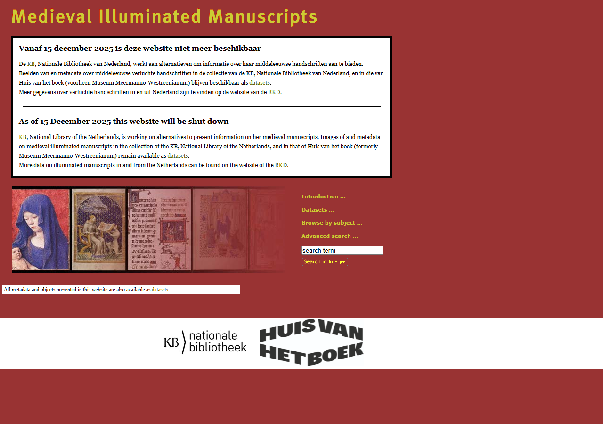
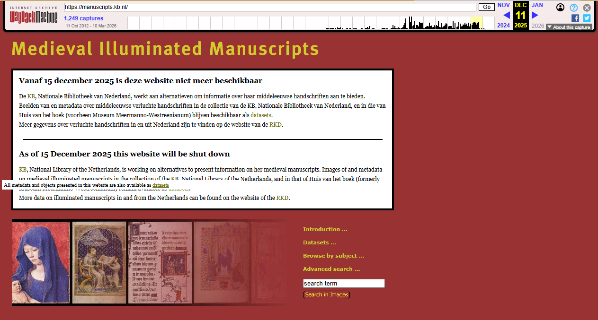
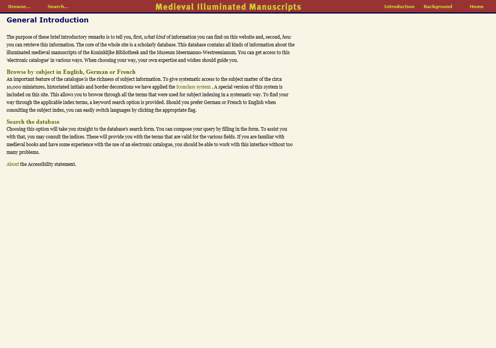
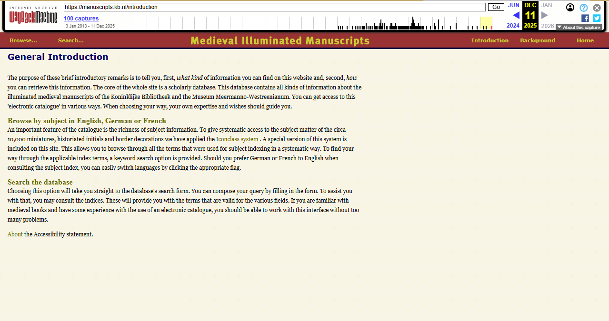
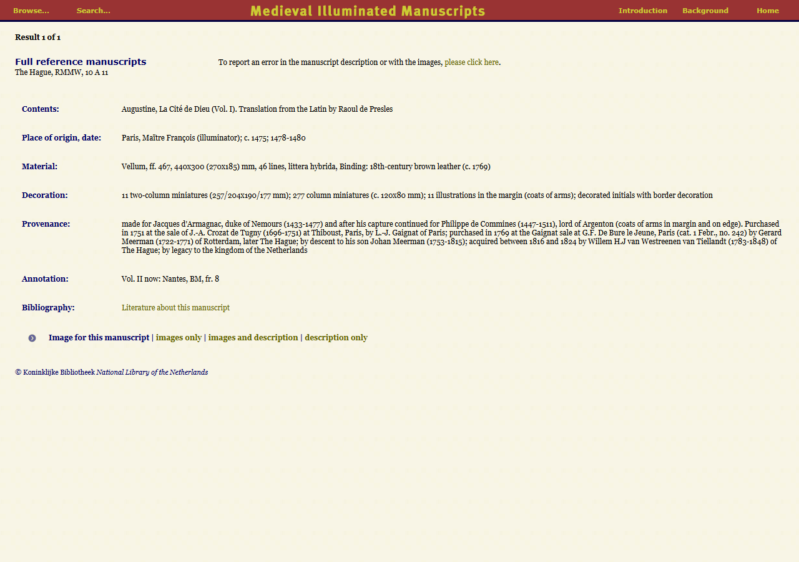
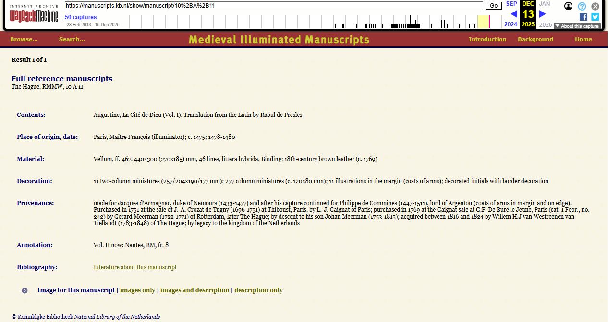
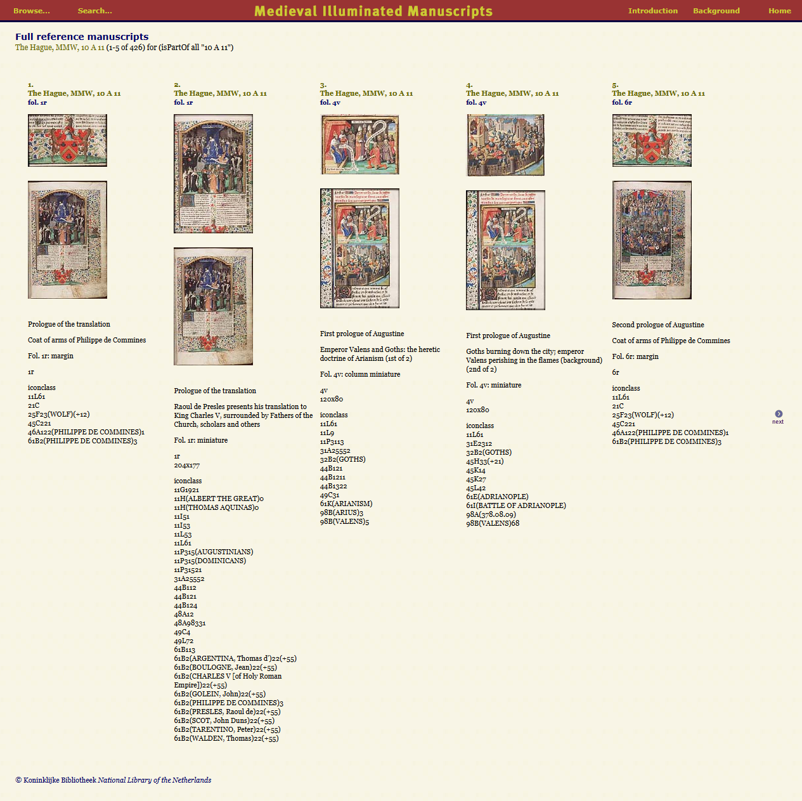
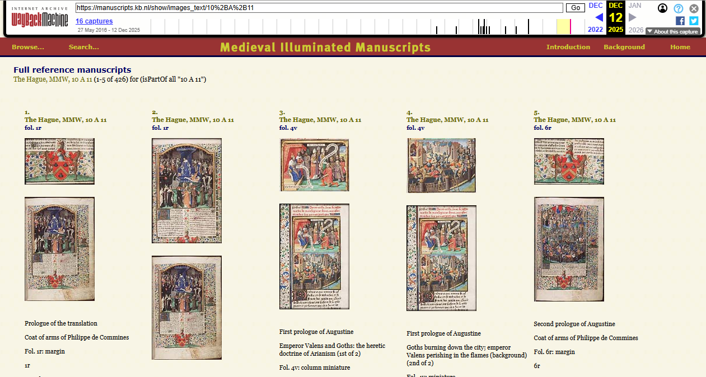
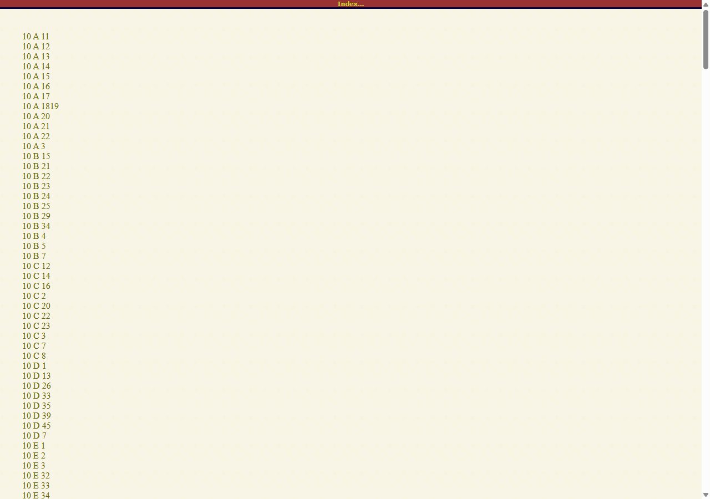
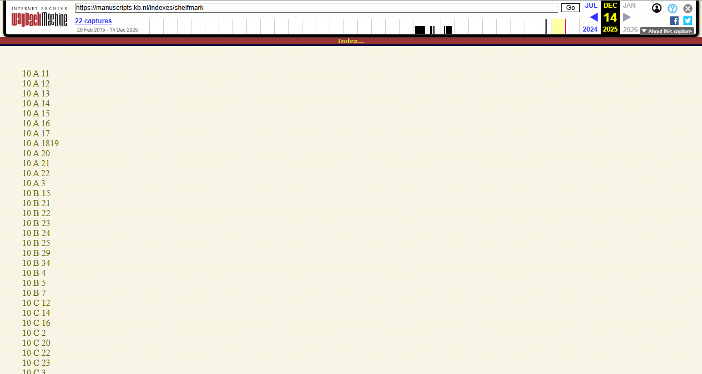

[← Back to Archived sites](../)

# Saving manuscripts.kb.nl to the Wayback Machine
*Latest update: 28-04-2026*

## About

[manuscripts.kb.nl](https://manuscripts.kb.nl/) - the **Medieval Illuminated Manuscripts** (Middeleeuwse Verluchte Handschriften / MVH) database of the KB, National Library of the Netherlands - was shut down on 15 December 2025.

<br/>
*Screenshot of manuscripts.kb.nl homepage, December 2025*

Before the site went offline, the KB spidered and archived a representative sample of its URLs to [The Wayback Machine](https://web.archive.org/) (WBM) during **10-14 December 2025**.

## Results & URL spreadsheet

* [manuscripts-urls-wbm-archived.xlsx]({{ site.github.repository_url }}/tree/main/archived-sites/manuscripts.kb.nl/manuscripts-urls-wbm-archived.xlsx) is the master spreadsheet for everything archived from manuscripts.kb.nl. It gives a detailed overview of all 7,460 archived URLs with per-URL status, WBM submission and capture URLs/timestamps, and Wikipedia/Commons metadata where applicable.

* The [Excel detail page](excel-details.md) gives the full column-by-column breakdown of all nine sheets in the Excel:
  1. `ALL_URLS` (7,460 rows — union of all sheets below)
  2. `show_manuscript` (2,371 rows — manuscript detail pages)
  3. `show_images_text` (2,322 rows — image gallery pages)
  4. `show_text` (1,520 rows — text-only views)
  5. `search_extended` (806 rows — extended search results)
  6. `search_literature` (397 rows — literature search results)
  7. `indexes` (9 rows — browse index pages)
  8. `static_pages` (8 rows — homepage, introduction, background, advanced search)
  9. `wiki_priority` (61 rows — all URLs linked from Wikipedia/Commons)

* [manuscripts-urls-spider-output.xlsx]({{ site.github.repository_url }}/tree/main/archived-sites/manuscripts.kb.nl/_spider-artifacts/manuscripts-urls-spider-output.xlsx) contains the full spider crawl output (12,550 URLs). The 5,117 URLs not selected for archiving are mostly image search result pages.


## Screenshots

Each pair shows the original manuscripts.kb.nl page (left) and the same URL as captured in the Wayback Machine (right, with the WBM toolbar visible at the top). The original site is no longer available per 15 December 2025.

#### Homepage

<table>
<tr><th width="50%">Original (defunct)</th><th width="50%">Wayback Machine</th></tr>
<tr><td></td><td></td></tr>
</table>

- Original: <https://manuscripts.kb.nl/>
- Wayback Machine (11-12-2025): <https://web.archive.org/web/20251211222502/https://manuscripts.kb.nl/>

#### Introduction

<table>
<tr><th width="50%">Original (defunct)</th><th width="50%">Wayback Machine</th></tr>
<tr><td></td><td></td></tr>
</table>

- Original: <https://manuscripts.kb.nl/introduction>
- Wayback Machine (11-12-2025): <https://web.archive.org/web/20251211005548/https://manuscripts.kb.nl/introduction>

#### Manuscript detail page (10 A 11)

<table>
<tr><th width="50%">Original (defunct)</th><th width="50%">Wayback Machine</th></tr>
<tr><td></td><td></td></tr>
</table>

- Original: <https://manuscripts.kb.nl/show/manuscript/10+A+11>
- Wayback Machine (13-12-2025): <https://web.archive.org/web/20251213032801/https://manuscripts.kb.nl/show/manuscript/10+A+11>

#### Images and description (10 A 11)

<table>
<tr><th width="50%">Original (defunct)</th><th width="50%">Wayback Machine</th></tr>
<tr><td></td><td></td></tr>
</table>

- Original: <https://manuscripts.kb.nl/show/images_text/10+A+11>
- Wayback Machine (12-12-2025): <https://web.archive.org/web/20251212054623/https://manuscripts.kb.nl/show/images_text/10+A+11>

#### Shelfmark index

<table>
<tr><th width="50%">Original (defunct)</th><th width="50%">Wayback Machine</th></tr>
<tr><td></td><td></td></tr>
</table>

- Original: <https://manuscripts.kb.nl/indexes/shelfmark>
- Wayback Machine (14-12-2025): <https://web.archive.org/web/20251214002409/https://manuscripts.kb.nl/indexes/shelfmark>

## How manuscripts.kb.nl got into the Wayback Machine

### 1. Spidering the site

Unlike mmdc.nl, manuscripts.kb.nl was a server-rendered site, so a straightforward HTTP crawler could discover all URLs. A custom spider was built, see the [`_spider-artifacts/`]({{ site.github.repository_url }}/blob/main/archived-sites/manuscripts.kb.nl/_spider-artifacts/) folder:

1. **[Seed URLs]({{ site.github.repository_url }}/blob/main/archived-sites/manuscripts.kb.nl/_spider-artifacts/seed-urls.txt)** — homepage, introduction, background, advanced search, and all 9 index pages (shelfmark, author/title, place, language, iconclass, image type, miniaturist, has part, title/image).

2. **[Crawler]({{ site.github.repository_url }}/blob/main/archived-sites/manuscripts.kb.nl/_spider-artifacts/scripts/spider.py)** — Python + requests/BeautifulSoup, crawls each page, extracts internal links, and classifies them into categories (manuscript detail, image galleries, text views, search results, indexes, static pages) via [config.py]({{ site.github.repository_url }}/blob/main/archived-sites/manuscripts.kb.nl/_spider-artifacts/scripts/config.py).

3. **Output** — 12,550 unique URLs written to [manuscripts-urls-spider-output.xlsx](_spider-artifacts/manuscripts-urls-spider-output.xlsx).

Full planning notes: [PLAN-url-spider-manuscripts.kb.nl.md]({{ site.github.repository_url }}/blob/main/archived-sites/manuscripts.kb.nl/_spider-artifacts/docs/PLAN-url-spider-manuscripts.kb.nl.md).

### 2. Submitting to the Wayback Machine

The discovered URLs were submitted to the Wayback Machine using the Internet Archive's [Save Page Now 2 (SPN2) API](https://web.archive.org/save) with authenticated access, in two phases:

1. **Phase 1 — Wiki priority URLs (10-11 Dec 2025):** 61 URLs linked from Dutch Wikipedia and Wikimedia Commons were archived first using [SaveToWBM_manuscripts_wiki_priority.py]({{ site.github.repository_url }}/blob/main/archived-sites/manuscripts.kb.nl/_archiving-artifacts/scripts/SaveToWBM_manuscripts_wiki_priority.py). Completed in ~23 minutes. Result: **61/61 (100%) successfully archived**.

2. **Phase 2 — Bulk archiving (11-14 Dec 2025):** 7,433 URLs from the spider output were submitted sheet by sheet (smallest first: static_pages → indexes → search_literature → search_extended → show_text → show_images_text → show_manuscript) using [SaveToWBM_manuscripts_bulk.py]({{ site.github.repository_url }}/blob/main/archived-sites/manuscripts.kb.nl/_archiving-artifacts/scripts/SaveToWBM_manuscripts_bulk.py). Rate-limited at 17 seconds between requests. Result: **7,433/7,433 (100%) successfully archived**, with only 4 transient errors (<0.1%) that were retried successfully.

Full planning notes: [PLAN-wbm-archiving-manuscripts.kb.nl.md]({{ site.github.repository_url }}/blob/main/archived-sites/manuscripts.kb.nl/_archiving-artifacts/docs/PLAN-wbm-archiving-manuscripts.kb.nl.md).


## Folder structure

```
manuscripts.kb.nl/
├── index.md                                 # This page
├── excel-details.md                         # Column-by-column breakdown of the Excel
├── manuscripts-urls-wbm-archived.xlsx       # Master URL list with WBM status (7,460 URLs)
├── wiki-priority-urls-WBM.xlsx              # Original wiki priority list (merged into master)
├── images/                                  # Before/after screenshots
├── wiki-url-replacements-completed/         # Overview of Wikipedia/Commons link updates
│   └── manuscripts-urls-wbm-archived-wiki.xlsx  # All 61 replacements with proposed wikitext
├── _spider-artifacts/                       # URL discovery (the spidering run)
│   ├── manuscripts-urls-spider-output.xlsx  # Full spider output (12,550 URLs)
│   ├── seed-urls.txt                        # Spider seed URLs
│   ├── scripts/                             # spider.py, config.py, excel_writer.py
│   ├── data/                               # ⛔ NOT ON GITHUB (spider_state.json etc.)
│   ├── docs/                                # PLAN-url-spider-manuscripts.kb.nl.md
│   └── logs/                                # crawl.log
└── _archiving-artifacts/                    # WBM submission
    ├── scripts/                             # 3 core Python scripts:
    │   ├── SaveToWBM_manuscripts_wiki_priority.py  # submit wiki-priority URLs to WBM
    │   ├── SaveToWBM_manuscripts_bulk.py           # submit all URLs sheet by sheet to WBM
    │   ├── lookup_wbm_captures.py                  # CDX lookup for actual capture URLs
    │   └── .env                                    # ⛔ NOT ON GITHUB (IA API keys)
    ├── data/                                # ⛔ NOT ON GITHUB (progress/checkpoint JSON files)
    ├── docs/                                # PLAN-wbm-archiving-manuscripts.kb.nl.md
    └── logs/                                # ⛔ NOT ON GITHUB (archiving logs)
```

## Timeline

| Date | Activity | Output |
|------|----------|--------|
| 2025-12-10 | Site spidering with Python + requests/BeautifulSoup; probe crawl of 15 seed URLs (100% success, ~1.6s avg response) | 12,550 URLs in [manuscripts-urls-spider-output.xlsx](_spider-artifacts/manuscripts-urls-spider-output.xlsx) |
| **2025-12-10 → 2025-12-11** | Wiki priority archiving: 61 URLs linked from Dutch Wikipedia and Wikimedia Commons submitted via SPN2 API | **61/61 (100%) successfully archived** |
| **2025-12-11 → 2025-12-14** | Bulk WBM submission of 7,433 URLs, sheet by sheet (smallest first), at 17s/request | **7,433/7,433 (100%) successfully archived** |
| **2025-12-15** | manuscripts.kb.nl officially shut down | Live site no longer available |
| 2026-04-24 | CDX capture URL lookup; documentation and spreadsheet consolidation | Capture URLs and timestamps added to master Excel |
| 2026-04-28 | Manual update of 61 wiki-priority links on Dutch Wikipedia (13 articles) and Wikimedia Commons (48 file pages) | Dead manuscripts.kb.nl links augmented with WBM archive URLs |

## Wikipedia & Commons link updates

All 61 wiki-priority URLs have been manually updated on the corresponding Dutch Wikipedia articles and Wikimedia Commons file pages (24-28 April 2026). The now-defunct manuscripts.kb.nl links were augmented with their Wayback Machine capture URLs:
- **13 Dutch Wikipedia articles** — updated using the <a href="https://nl.wikipedia.org/wiki/Sjabloon:Citeer_web"><code>&#123;&#123;Citeer web&#125;&#125;</code></a> template with `archiefurl`, `archiefdatum`, and `dodeurl=ja` parameters
- **48 Wikimedia Commons file pages** — updated using the <a href="https://commons.wikimedia.org/wiki/Template:Wayback"><code>&#123;&#123;Wayback&#125;&#125;</code></a> template in the `source` field and other relevant fields

The full overview of all replacements is available in [`wiki-url-replacements-completed/manuscripts-urls-wbm-archived-wiki.xlsx`]({{ site.github.repository_url }}/tree/main/archived-sites/manuscripts.kb.nl/wiki-url-replacements-completed).

## Notes & known issues

- The spider discovered 12,550 URLs; 7,433 were selected for archiving. The remaining ~5,100 were mostly image search result pages (`/search/images_text/extended/...`) and other low-priority pages.
- 61 URLs linked from Wikimedia projects were archived as a first priority. 34 of these overlap with the main bulk run; 27 are unique to the `wiki_priority` sheet (mostly `/zoom/` image viewer URLs).
- The site served both `http://` and `https://` URLs — Wikipedia/Commons links often used `http://` while the spider discovered `https://` versions.
