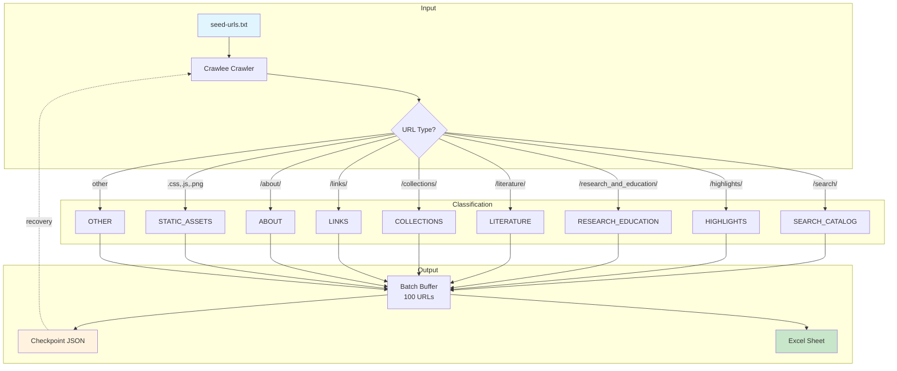
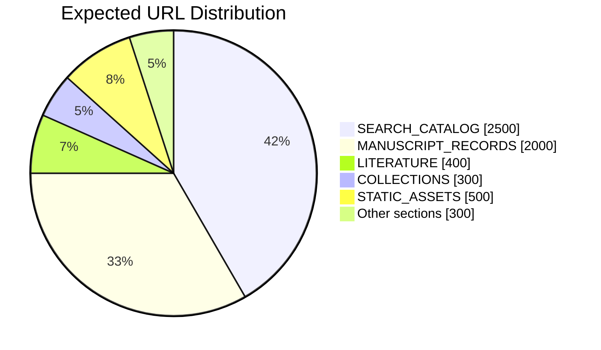

# URL Spider Plan: mmdc.nl
## Complete URL Discovery for Medieval Manuscripts Digital Collection

**Status:** APPROVED - Ready for Implementation
**Created:** 2025-12-06
**Agent:** Jantien (Claude Code)
**Target:** https://mmdc.nl/

---

## Visual Overview

```mermaid
gantt
    title mmdc.nl URL Spider - Implementation Timeline
    dateFormat  HH:mm
    axisFormat %H:%M

    section Phase 1: Setup
    Create folder structure       :p1a, 00:00, 10m
    Install dependencies          :p1b, after p1a, 10m
    Probe crawl (20 URLs)        :p1c, after p1b, 10m
    Initialize Excel             :p1d, after p1c, 5m

    section Phase 2: Static
    Crawl seed URLs              :p2a, after p1d, 30m
    Follow internal links        :p2b, after p2a, 45m
    Batch write to Excel         :p2c, after p2b, 15m

    section Phase 3: Catalog
    Paginate search results      :p3a, after p2c, 60m
    Extract manuscript URLs      :p3b, after p3a, 90m
    Handle AJAX/JS pages         :p3c, after p3b, 30m

    section Phase 4: Verify
    Deduplicate Excel            :p4a, after p3c, 10m
    Count & validate URLs        :p4b, after p4a, 10m
    Generate summary report      :p4c, after p4b, 10m
```







---

## Executive Summary

This plan outlines the complete URL discovery strategy for mmdc.nl before the December 15, 2025 shutdown. The goal is to capture ALL URLs present on the site and save them to an Excel file with functional groupings, using a streaming/incremental approach for resilience.

---

## 1. Tool Selection & Recommendations

### Primary Crawler: Crawlee for Python

**Why Crawlee over Scrapy/other options:**

| Feature | Crawlee | Scrapy | requests+BeautifulSoup |
|---------|---------|--------|------------------------|
| Async native | Yes | Yes | Manual |
| JS rendering | PlaywrightCrawler | Scrapy-playwright | Manual |
| Built-in throttling | Yes | Yes | Manual |
| Request queue & dedup | Built-in | Built-in | Manual |
| Resumability | Built-in state | Custom | Manual |
| Modern Python (3.10+) | Yes | Yes | Yes |
| Learning curve | Low | Medium | Low |

**Recommendation:** Use `BeautifulSoupCrawler` from Crawlee for static pages, with `PlaywrightCrawler` fallback for JS-heavy sections (like the search catalog).

### Excel Streaming: openpyxl write_only mode

```python
from openpyxl import Workbook
wb = Workbook(write_only=True)
ws = wb.create_sheet("Sheet Name")
ws.append(["URL", "Section", "Discovered", "Status"])  # Header
# Stream rows in batches
for url in batch:
    ws.append([url, section, timestamp, "pending"])
wb.save("urls.xlsx")
```

**Alternative for very large files:** OpenSpout (PHP) or xlsxwriter (Python) for even better memory efficiency.

### Required Python Packages

```
crawlee[beautifulsoup]>=0.5.0
crawlee[playwright]>=0.5.0
openpyxl>=3.1.0
aiofiles>=24.1.0
tqdm>=4.66.0
```

---

## 2. Discovered Functional Groups (Sheets)

Based on `seed-urls.txt` analysis:

| Sheet Name | Base URL Pattern | Expected Size |
|------------|------------------|---------------|
| ENTRY_POINT | `/` | 1 |
| SEARCH_CATALOG | `/static/site/search/*` | 1000s (paginated) |
| HIGHLIGHTS | `/static/site/highlights/*` | 10-50 |
| RESEARCH_EDUCATION | `/static/site/research_and_education/*` | 10-50 |
| LITERATURE | `/static/site/literature/*` | 100-500 |
| COLLECTIONS | `/static/site/collections/*` | 100-500 |
| LINKS | `/static/site/links/*` | 10-50 |
| ABOUT | `/static/site/about/*` | 10-20 |
| MANUSCRIPT_RECORDS | `/manuscripts/*` or record IDs | 1000s |
| STATIC_ASSETS | `/static/*` (CSS, JS, images) | 100s |
| OTHER | Uncategorized | Variable |

**Note:** Sheet names limited to 31 characters in Excel.

---

## 3. Throttling Strategy

### Initial Probe Phase

Before full crawl, perform a test crawl of ~20 URLs to measure:
- Average response time
- Any rate limiting headers (429, Retry-After)
- robots.txt crawl-delay (ignore per instructions, but note)

### Recommended Settings

```python
concurrency_settings = ConcurrencySettings(
    desired_concurrency=3,    # Start conservative
    min_concurrency=1,
    max_concurrency=5,        # Never exceed 5 concurrent
)

# Add delay between requests
request_handler_timeout = timedelta(seconds=30)
```

**Throttle parameters:**
- **Delay between requests:** 1-2 seconds
- **Max concurrent requests:** 3-5
- **Requests per minute:** ~30-60
- **Backoff on errors:** Exponential (2x, max 60s)

---

## 4. Architecture

### File Structure

```
archived-sites/mmdc.nl/
├── mmdc-urls-spider-output.xlsx    # Main output (root)
├── _spider-artifacts/               # Gitignore this folder
│   ├── crawler_state/              # Crawlee state for resumption
│   ├── logs/
│   │   ├── crawl.log
│   │   └── errors.log
│   ├── checkpoints/
│   │   ├── urls_batch_001.json
│   │   ├── urls_batch_002.json
│   │   └── ...
│   ├── spider.py                   # Main crawler script
│   ├── excel_writer.py             # Streaming Excel writer
│   ├── config.py                   # Configuration
│   └── recovery.py                 # Recovery/resume logic
└── seed-urls.txt                   # Existing seed file
```

### Data Flow

```
┌─────────────┐     ┌──────────────┐     ┌─────────────────┐
│  Seed URLs  │────>│   Crawlee    │────>│  URL Queue      │
│  (txt file) │     │   Crawler    │     │  (dedup built-in)│
└─────────────┘     └──────────────┘     └────────┬────────┘
                           │                       │
                           ▼                       ▼
                    ┌──────────────┐     ┌─────────────────┐
                    │ Batch Buffer │────>│ Checkpoint JSON │
                    │ (100 URLs)   │     │ (recovery)      │
                    └──────┬───────┘     └─────────────────┘
                           │
                           ▼
                    ┌──────────────┐
                    │ Excel Writer │
                    │ (streaming)  │
                    └──────────────┘
```

---

## 5. Resumability & Recovery

### Checkpoint Strategy

Every 100 URLs:
1. Save URLs to `checkpoints/urls_batch_XXX.json`
2. Update crawler state
3. Flush to Excel (append rows)

### Recovery Process

On failure/restart:
1. Load all `urls_batch_*.json` files
2. Build set of already-crawled URLs
3. Resume Crawlee with remaining queue
4. Continue appending to Excel (using `openpyxl` load + append)

### State File Format

```json
{
  "last_batch": 42,
  "total_urls_found": 4200,
  "last_checkpoint": "2025-12-06T18:30:00",
  "sheets": {
    "SEARCH_CATALOG": 2150,
    "HIGHLIGHTS": 35,
    ...
  }
}
```

---

## 6. URL Classification Logic

```python
from urllib.parse import urlparse

def classify_url(url: str) -> str:
    """Classify URL into functional group (sheet name)."""
    path = urlparse(url).path.lower()

    if '/search/' in path or 'searchmode=' in url.lower():
        return "SEARCH_CATALOG"
    elif '/highlights/' in path:
        return "HIGHLIGHTS"
    elif '/research_and_education/' in path:
        return "RESEARCH_EDUCATION"
    elif '/literature/' in path:
        return "LITERATURE"
    elif '/collections/' in path:
        return "COLLECTIONS"
    elif '/links/' in path:
        return "LINKS"
    elif '/about/' in path:
        return "ABOUT"
    elif any(ext in path for ext in ['.css', '.js', '.png', '.jpg', '.gif', '.svg', '.woff']):
        return "STATIC_ASSETS"
    elif path == '/' or path == '':
        return "ENTRY_POINT"
    else:
        return "OTHER"
```

---

## 6b. Updated Crawlee Code Patterns (v0.5+)

> **Note:** These patterns are based on the latest Crawlee Python documentation (December 2025).

### Basic BeautifulSoupCrawler Setup

```python
import asyncio
from crawlee.crawlers import BeautifulSoupCrawler, BeautifulSoupCrawlingContext

async def main() -> None:
    crawler = BeautifulSoupCrawler(
        max_requests_per_crawl=None,  # No limit - crawl everything
    )

    @crawler.router.default_handler
    async def request_handler(context: BeautifulSoupCrawlingContext) -> None:
        context.log.info(f'Processing {context.request.url} ...')

        # Extract data
        data = {
            'url': context.request.url,
            'title': context.soup.title.string if context.soup.title else None,
        }

        # Save to dataset
        await context.push_data(data)

        # Enqueue links (same-origin only)
        await context.enqueue_links(strategy='same-origin')

    await crawler.run(['https://mmdc.nl/'])

    # Export all data to CSV
    await crawler.export_data(path='results.csv')

if __name__ == '__main__':
    asyncio.run(main())
```

### PlaywrightCrawler for JS-Rendered Pages

```python
import asyncio
from crawlee.crawlers import PlaywrightCrawler, PlaywrightCrawlingContext

async def main() -> None:
    crawler = PlaywrightCrawler(
        headless=True,
        browser_type='chromium',
        max_requests_per_crawl=None,
    )

    @crawler.router.default_handler
    async def request_handler(context: PlaywrightCrawlingContext) -> None:
        context.log.info(f'Processing {context.request.url} ...')
        await context.enqueue_links(strategy='same-origin')

    await crawler.run(['https://mmdc.nl/static/site/search/'])

if __name__ == '__main__':
    asyncio.run(main())
```

### Concurrency Settings

```python
from crawlee import ConcurrencySettings

concurrency = ConcurrencySettings(
    min_concurrency=1,
    max_concurrency=5,           # Conservative for mmdc.nl
    desired_concurrency=3,
    max_tasks_per_minute=60,     # ~1 request/second
)

crawler = BeautifulSoupCrawler(
    concurrency_settings=concurrency,
)
```

### State Persistence for Resume

```python
import os
from crawlee import service_locator

# Enable persistence (alternative: set CRAWLEE_PURGE_ON_START=0)
configuration = service_locator.get_configuration()
configuration.purge_on_start = False

# Or via environment variable before running:
# CRAWLEE_PURGE_ON_START=0 python spider.py
```

### Export to Dataset and File

```python
from crawlee.storages import Dataset

# Open named dataset
dataset = await Dataset.open(name='mmdc_urls')

# Push data
await dataset.push_data({'url': url, 'section': section})

# Export to JSON
await dataset.export_to('urls.json', content_type='json')

# Export to CSV
await dataset.export_to('urls.csv', content_type='csv')
```

### Error and Skipped Request Handlers

```python
from crawlee import SkippedReason

@crawler.error_handler
async def handle_error(context, error) -> None:
    context.log.error(f'Error processing {context.request.url}: {error}')

@crawler.failed_request_handler
async def handle_failed(context) -> None:
    context.log.error(f'Request failed after retries: {context.request.url}')

@crawler.on_skipped_request
async def handle_skipped(url: str, reason: SkippedReason) -> None:
    crawler.log.warning(f'Skipped {url}: {reason}')
```

---

## 7. Implementation Phases

### Phase 1: Setup & Initial Probe (30 min)

| Step | Task | Output |
|------|------|--------|
| 1.1 | Create folder structure | `_spider-artifacts/` |
| 1.2 | Install dependencies | `pip install crawlee[beautifulsoup] openpyxl` |
| 1.3 | Probe crawl (20 URLs) | Throttle recommendations |
| 1.4 | Initialize Excel with headers | Empty workbook with sheets |

### Phase 2: Static Page Discovery (1-2 hours)

| Step | Task | Output |
|------|------|--------|
| 2.1 | Crawl seed URLs | Discover linked pages |
| 2.2 | Follow internal links | Expand URL set |
| 2.3 | Batch write to Excel | Streaming append |
| 2.4 | Checkpoint state | Recovery files |

### Phase 3: Search Catalog Deep Crawl (2-4 hours)

| Step | Task | Output |
|------|------|--------|
| 3.1 | Paginate search results | All result pages |
| 3.2 | Extract manuscript record URLs | Individual records |
| 3.3 | Handle AJAX/JS if needed | PlaywrightCrawler |
| 3.4 | Continue streaming to Excel | Updated workbook |

### Phase 4: Verification & Cleanup (30 min)

| Step | Task | Output |
|------|------|--------|
| 4.1 | Deduplicate final Excel | Clean data |
| 4.2 | Count URLs per sheet | Statistics |
| 4.3 | Validate URL format | Quality check |
| 4.4 | Generate summary report | Stats in log |

---

## 8. Excel Output Format

### Sheet Structure (per functional group)

| Column | Header | Description |
|--------|--------|-------------|
| A | URL | Full URL |
| B | Path | URL path only |
| C | Discovered | ISO timestamp |
| D | Batch | Batch number |
| E | Status | pending/archived/failed |
| F | Notes | Optional notes |

### Example Row

```
| https://mmdc.nl/static/site/highlights/123.html | /static/site/highlights/123.html | 2025-12-06T18:30:00 | 5 | pending | |
```

---

## 9. Risk Mitigation

| Risk | Mitigation |
|------|------------|
| Site goes offline during crawl | Checkpoint every 100 URLs |
| Rate limiting/blocking | Conservative throttle, rotate User-Agent |
| Memory issues with large Excel | write_only mode, batch processing |
| JS-rendered content missed | Playwright fallback for search pages |
| Duplicate URLs | Crawlee built-in deduplication |
| Incomplete discovery | Multiple seed entry points |

---

## 10. User Decisions (Answered)

| Question | Decision | Rationale |
|----------|----------|-----------|
| Playwright Installation | **Already installed** | No setup needed |
| Static Assets | **Yes, include all** | Complete archive requires all assets |
| Search Catalog Depth | **All pages** | Comprehensive crawl before shutdown |
| Next Step | **Enhance plan first** | Added sections below |

---

## 11. Error Handling Strategy

### HTTP Error Responses

| Status Code | Action | Retry |
|-------------|--------|-------|
| 200 | Process normally | N/A |
| 301/302 | Follow redirect, log both URLs | N/A |
| 400 | Log error, skip URL | No |
| 403 | Log, reduce concurrency, retry once | Yes (1x) |
| 404 | Log as dead link, continue | No |
| 429 | Backoff exponentially, retry | Yes (3x) |
| 500-503 | Log, wait 30s, retry | Yes (2x) |
| Timeout | Log, retry with longer timeout | Yes (2x) |

### Error Recovery Code Pattern

```python
from crawlee import Request
from crawlee.errors import SessionError

async def request_handler(context):
    try:
        # Normal processing
        await process_page(context)
    except SessionError as e:
        context.log.warning(f"Session error: {e}, will retry")
        raise  # Crawlee handles retry
    except Exception as e:
        # Log to errors.log, don't retry
        await log_error(context.request.url, str(e))
        # Don't re-raise - marks as handled

# Configure retry behavior
crawler = BeautifulSoupCrawler(
    max_request_retries=3,
    request_handler_timeout=timedelta(seconds=60),
)
```

### Critical Failure Handling

If >10% of requests fail in a 5-minute window:
1. Pause crawling for 5 minutes
2. Log warning to console
3. Reduce concurrency to 1
4. Resume with exponential backoff

---

## 12. Logging Configuration

### Log Levels & Destinations

| Level | Destination | Content |
|-------|-------------|---------|
| DEBUG | `logs/crawl.log` | All requests, responses, timings |
| INFO | Console + `logs/crawl.log` | Progress updates, batch completions |
| WARNING | Console + `logs/errors.log` | Retries, rate limits, recoverable errors |
| ERROR | Console + `logs/errors.log` | Failed requests, critical issues |

### Log Format

```python
import logging

LOG_FORMAT = "%(asctime)s | %(levelname)-8s | %(name)s | %(message)s"
DATE_FORMAT = "%Y-%m-%d %H:%M:%S"

# File handler
file_handler = logging.FileHandler("_spider-artifacts/logs/crawl.log")
file_handler.setFormatter(logging.Formatter(LOG_FORMAT, DATE_FORMAT))
file_handler.setLevel(logging.DEBUG)

# Console handler (less verbose)
console_handler = logging.StreamHandler()
console_handler.setFormatter(logging.Formatter("%(levelname)s: %(message)s"))
console_handler.setLevel(logging.INFO)
```

### Progress Reporting

Every 100 URLs, log:
```
INFO: Progress | URLs: 1,234 | Queue: 456 | Errors: 12 | Rate: 45/min | ETA: 2h 15m
```

---

## 13. Exit & Completion Criteria

### Crawl is COMPLETE when ALL of these are true:

| Criterion | Check Method |
|-----------|--------------|
| Request queue is empty | `crawler.get_request_queue().is_empty()` |
| No pending retries | Retry queue length = 0 |
| All batches written to Excel | Last batch flushed |
| Final checkpoint saved | `state.json` updated |

### Crawl is SUCCESSFUL when:

- [ ] Total URLs > 1,000 (minimum expected)
- [ ] Error rate < 5% of total requests
- [ ] All functional groups have at least 1 URL
- [ ] Excel file is valid (can be opened)
- [ ] No duplicate URLs within sheets

### Early Termination Conditions

Stop crawling immediately if:
1. Site returns 403 for >50% of requests (blocked)
2. Site is unreachable for >10 minutes
3. Disk space < 500MB
4. User sends interrupt signal (Ctrl+C)

On early termination:
1. Save current state immediately
2. Flush pending URLs to Excel
3. Log termination reason
4. Exit with non-zero code

---

## 14. Requirements Specification

### requirements.txt

```
# Core crawler
crawlee[beautifulsoup]>=0.5.0
crawlee[playwright]>=0.5.0

# Excel output
openpyxl>=3.1.0

# Async file operations
aiofiles>=24.1.0

# URL parsing (stdlib, but explicit)
# urllib.parse (built-in)

# Optional: progress bar
tqdm>=4.66.0
```

### Python Version

```
python_requires = ">=3.10"
```

### Installation Command

```bash
cd archived-sites/mmdc.nl/_spider-artifacts
pip install -r requirements.txt
# Playwright already installed per user confirmation
```

---

## 15. Estimated Timeline

| Phase | Duration | URLs Expected |
|-------|----------|---------------|
| Setup & Probe | 30 min | 20 |
| Static Discovery | 1-2 hours | 500-1000 |
| Search Catalog | 2-4 hours | 2000-5000+ |
| Verification | 30 min | - |
| **Total** | **4-7 hours** | **2500-6000+** |

---

## 16. Implementation Checklist

### Phase 1: Setup & Initial Probe

| # | Task | Dependencies | Output | Status |
|---|------|--------------|--------|--------|
| 1.1 | Create `_spider-artifacts/` folder structure | None | Folders created | [ ] |
| 1.2 | Create `requirements.txt` | 1.1 | File in artifacts folder | [ ] |
| 1.3 | Install Python dependencies | 1.2 | Packages installed | [ ] |
| 1.4 | Create `config.py` with all settings | 1.1 | Configuration module | [ ] |
| 1.5 | Run probe crawl (20 URLs) | 1.3, 1.4 | Throttle recommendations | [ ] |
| 1.6 | Initialize Excel with headers | 1.3 | Empty workbook with 11 sheets | [ ] |

### Phase 2: Core Implementation

| # | Task | Dependencies | Output | Status |
|---|------|--------------|--------|--------|
| 2.1 | Create `spider.py` main crawler | 1.4 | Main crawler script | [ ] |
| 2.2 | Create `excel_writer.py` streaming writer | 1.3 | Excel helper module | [ ] |
| 2.3 | Create `recovery.py` checkpoint system | 1.4 | Recovery module | [ ] |
| 2.4 | Create `url_classifier.py` | 1.4 | URL classification logic | [ ] |
| 2.5 | Create `logging_config.py` | 1.4 | Logging setup | [ ] |
| 2.6 | Unit test core modules | 2.1-2.5 | Tests passing | [ ] |

### Phase 3: Crawling Execution

| # | Task | Dependencies | Output | Status |
|---|------|--------------|--------|--------|
| 3.1 | Load seed URLs from `seed-urls.txt` | 2.1 | URLs in queue | [ ] |
| 3.2 | Crawl static pages (follow links) | 3.1 | ~500-1000 URLs | [ ] |
| 3.3 | Crawl search catalog (all pages) | 3.2 | ~2000-5000 URLs | [ ] |
| 3.4 | Handle JS-rendered pages if needed | 3.3 | Playwright fallback | [ ] |
| 3.5 | Stream all URLs to Excel | 3.2-3.4 | Batches written | [ ] |
| 3.6 | Save checkpoints every 100 URLs | 3.2-3.4 | JSON checkpoints | [ ] |

### Phase 4: Verification & Cleanup

| # | Task | Dependencies | Output | Status |
|---|------|--------------|--------|--------|
| 4.1 | Deduplicate URLs per sheet | 3.5 | Clean Excel | [ ] |
| 4.2 | Count URLs per functional group | 4.1 | Statistics | [ ] |
| 4.3 | Validate all URLs are well-formed | 4.1 | Validation report | [ ] |
| 4.4 | Generate final summary report | 4.2, 4.3 | Summary in log | [ ] |
| 4.5 | Verify Excel file opens correctly | 4.1 | Manual check | [ ] |

### File Creation Order

```
_spider-artifacts/
├── 1. requirements.txt          ← First (enables pip install)
├── 2. config.py                 ← Second (shared settings)
├── 3. logging_config.py         ← Third (used by all modules)
├── 4. url_classifier.py         ← Fourth (used by spider)
├── 5. excel_writer.py           ← Fifth (output handler)
├── 6. recovery.py               ← Sixth (checkpoint system)
├── 7. spider.py                 ← Last (imports all above)
├── logs/
│   ├── crawl.log
│   └── errors.log
└── checkpoints/
    └── (generated during crawl)
```

### Quick Reference Commands

```bash
# Setup
cd archived-sites/mmdc.nl/_spider-artifacts
pip install -r requirements.txt

# Run crawler
python spider.py

# Resume after interruption
python spider.py --resume

# Check progress
tail -f logs/crawl.log
```

---

## 17. Success Criteria

- [ ] All discoverable URLs captured in Excel
- [ ] Excel organized by functional group (sheets)
- [ ] Zero duplicate URLs within sheets
- [ ] Recovery system tested and working
- [ ] Final URL count documented
- [ ] Ready for next phase (Wayback Machine archiving)

---

*Plan APPROVED and enhanced with error handling, logging, exit criteria, requirements, detailed implementation checklist, and updated Crawlee v0.5+ code patterns.*

*Last updated: 2025-12-06 (Enhanced version v3 - with latest Crawlee docs)*
