[← Back to Archived sites](../)

# Saving mmdc.nl to the Wayback Machine
*Latest update: 23-04-2026*

## About

[mmdc.nl](https://mmdc.nl/) - the *Medieval Manuscripts in Dutch Collections* website of the KB, national library of the Netherlands - has been phased out on 15 December 2025.

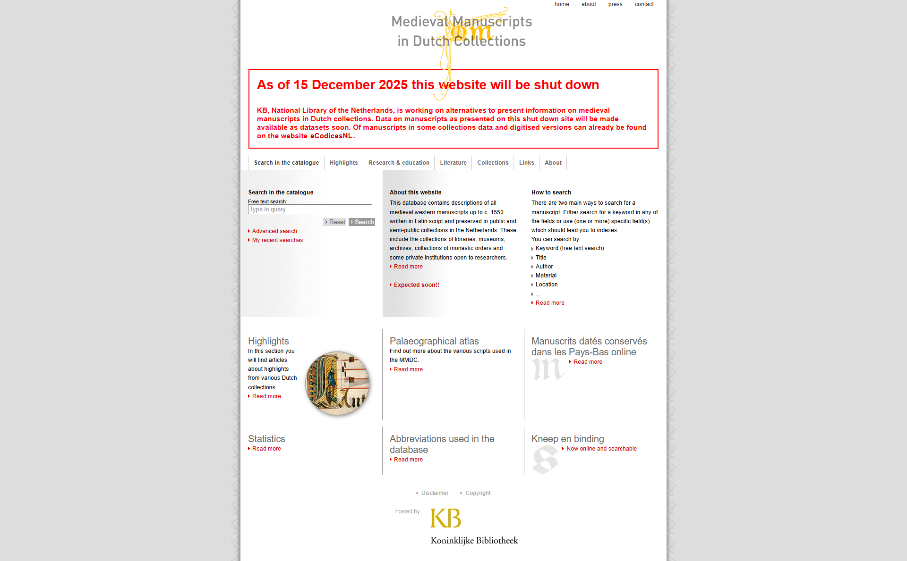

Before the site went offline, its URLs were archived to [The Wayback Machine](https://web.archive.org/) (WBM) of The Internet Archive in two phases: 

1. First, its static pages, PDFs and images were archived during **December 2025**.
2. In a second phase, the 11.738 manuscript catalog records were archived during **April 2026**, once their pre-rendered HTML form was ready (see below).

## Results & URL spreadsheet

* [mmdc-urls-unified_15042026.xlsx]({{ site.github.repository_url }}/tree/main/archived-sites/manuscripts.kb.nl/mmdc-urls-unified_15042026.xlsx) is the master spreadsheet and the single source of truth for everything archived from mmdc.nl. It gives a detailed overview of all mmdc.nl URLs captured in the WBM. These include per-URL status, WBM capture URLs and timestamps, and local file paths for every individual item. 

* The [Excel detail page](excel-details.md) gives the full column-by-column breakdown of all three sheets in the Excel: 
  1. `non-catalog-pages` (466 rows - Phase 1, Dec 2025)
  2. `catalog-pages` (11.738 rows - Phase 2, April 2026)
  3. `catalog-pages-full-metadata` (18.724 rows) 

## Screenshots

### 1. Static pages - before/after screenshots

Each pair shows the (now defunct) mmdc.nl page (left) and the same URL as captured in the Wayback Machine (right, with the WBM toolbar visible at the top).

#### Homepage

<table>
<tr><th width="50%">Original (defunct)</th><th width="50%">Wayback Machine</th></tr>
<tr><td></td><td></td></tr>
</table>

- Original: <https://mmdc.nl/static/site/>
- Wayback Machine (07-12-2025): <https://web.archive.org/web/20251207222812/https://mmdc.nl/static/site/>

#### Collections

<table>
<tr><th width="50%">Original (defunct)</th><th width="50%">Wayback Machine</th></tr>
<tr><td>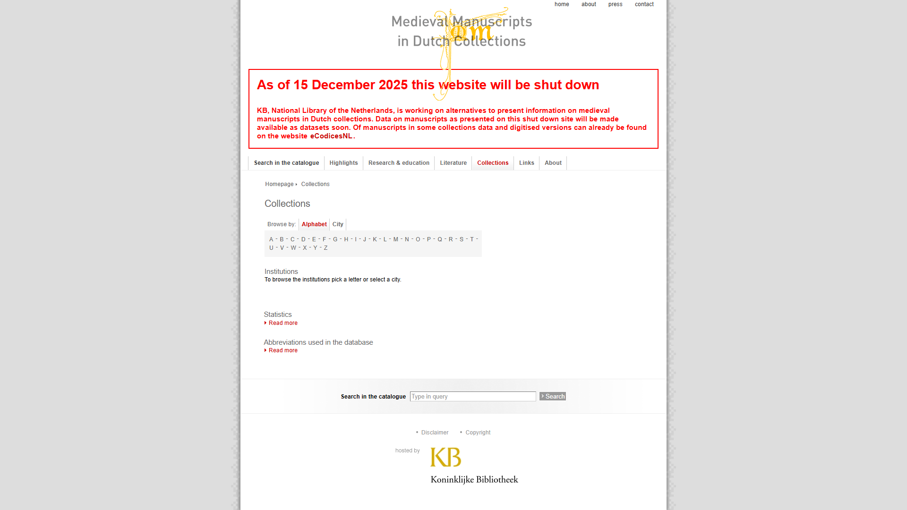</td><td>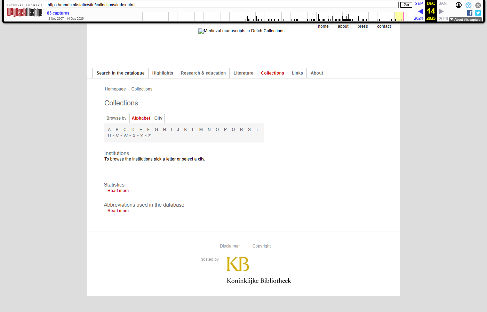</td></tr>
</table>

- Original: <https://mmdc.nl/static/site/collections/index.html>
- Wayback Machine (14-12-2025): <https://web.archive.org/web/20251214072708/https://mmdc.nl/static/site/collections/index.html>

#### Highlights

<table>
<tr><th width="50%">Original (defunct)</th><th width="50%">Wayback Machine</th></tr>
<tr><td>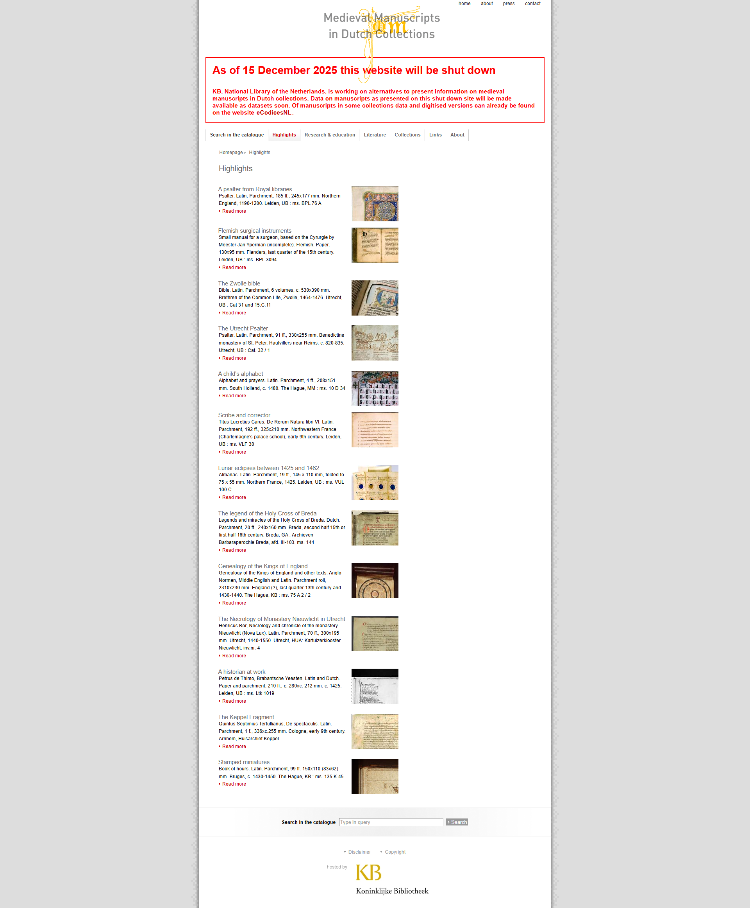</td><td></td></tr>
</table>

- Original: <https://mmdc.nl/static/site/highlights/index.html>
- Wayback Machine (14-12-2025): <https://web.archive.org/web/20251214074859/https://mmdc.nl/static/site/highlights/index.html>

#### Literature

<table>
<tr><th width="50%">Original (defunct)</th><th width="50%">Wayback Machine</th></tr>
<tr><td>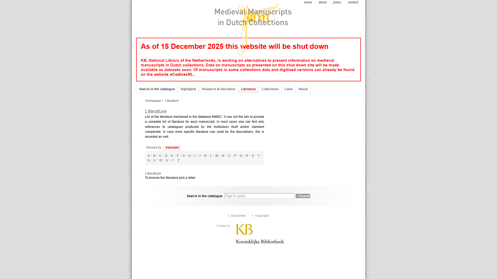</td><td>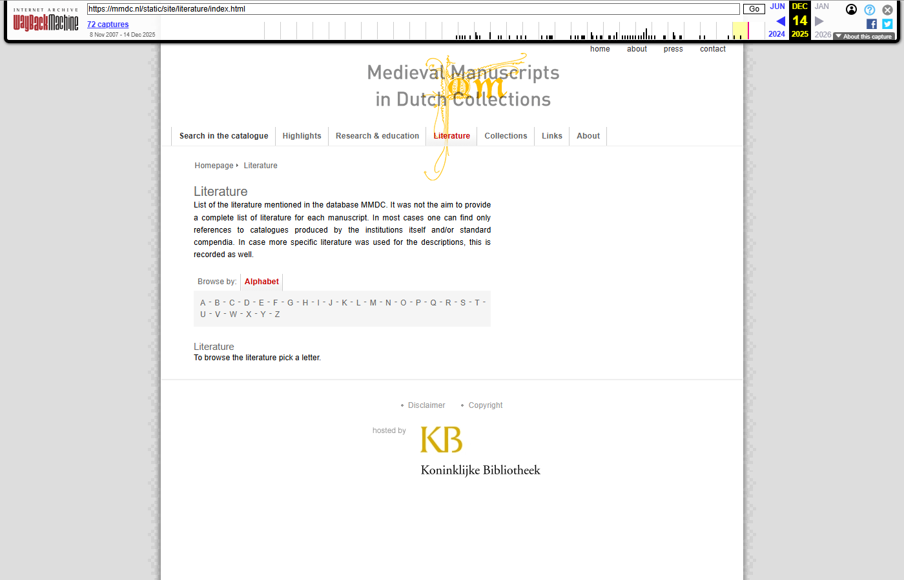</td></tr>
</table>

- Original: <https://mmdc.nl/static/site/literature/index.html>
- Wayback Machine (14-12-2025): <https://web.archive.org/web/20251214080033/https://mmdc.nl/static/site/literature/index.html>

#### Research & Education (Palaeography)

<table>
<tr><th width="50%">Original (defunct)</th><th width="50%">Wayback Machine</th></tr>
<tr><td>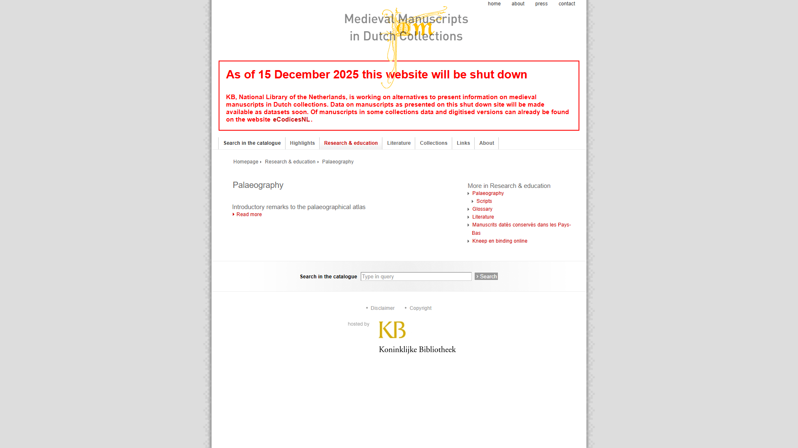</td><td>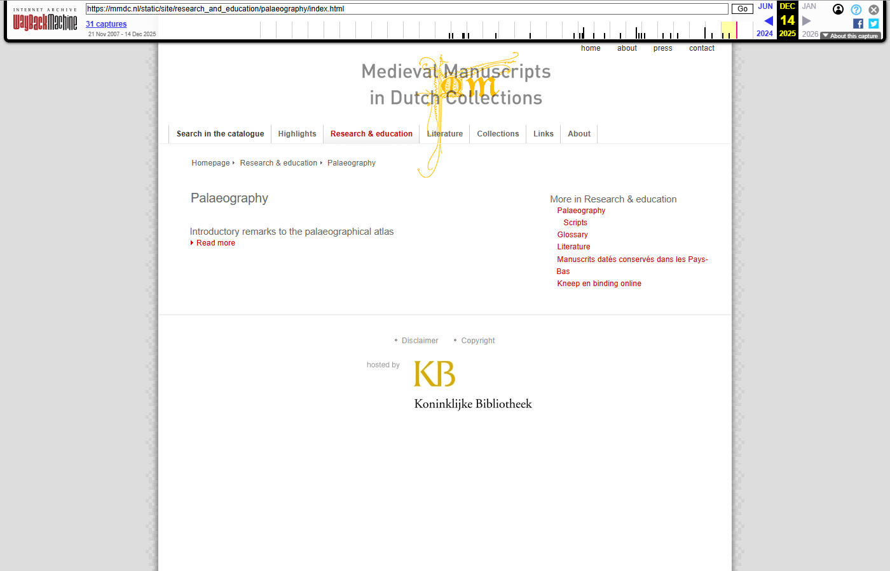</td></tr>
</table>

- Original: <https://mmdc.nl/static/site/research_and_education/palaeography/index.html>
- Wayback Machine (14-12-2025): <https://web.archive.org/web/20251214082705/https://mmdc.nl/static/site/research_and_education/palaeography/index.html>

#### About

<table>
<tr><th width="50%">Original (defunct)</th><th width="50%">Wayback Machine</th></tr>
<tr><td>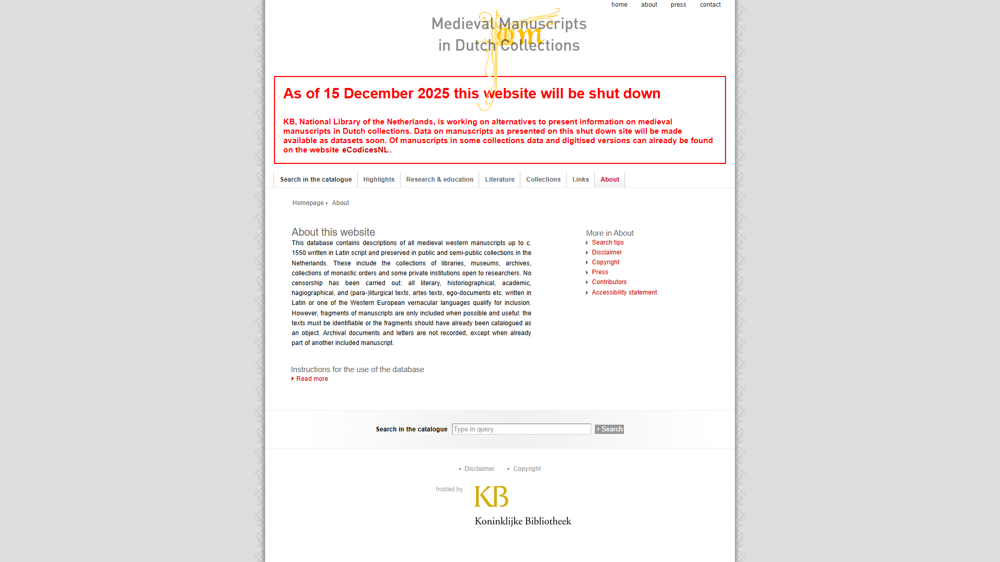</td><td></td></tr>
</table>

- Original: <https://mmdc.nl/static/site/about/index.html>
- Wayback Machine (14-12-2025): <https://web.archive.org/web/20251214063529/https://mmdc.nl/static/site/about/index.html>

### 2. Catalog pages

The 11.738 catalog (manuscript detail) records were JavaScript-rendered on the live site, so they were pre-rendered to static HTML and submitted to the Wayback Machine under the `/wbm/site/search/catalog-page-N.html` path. No comparable "before" WBM screenshot could be captured, because the JavaScript-based catalog pages were not suitable to be captured by the WBM - only the archived version of the pre-rendered HTML is shown below.

<table>
<tr>
  <td width="30%">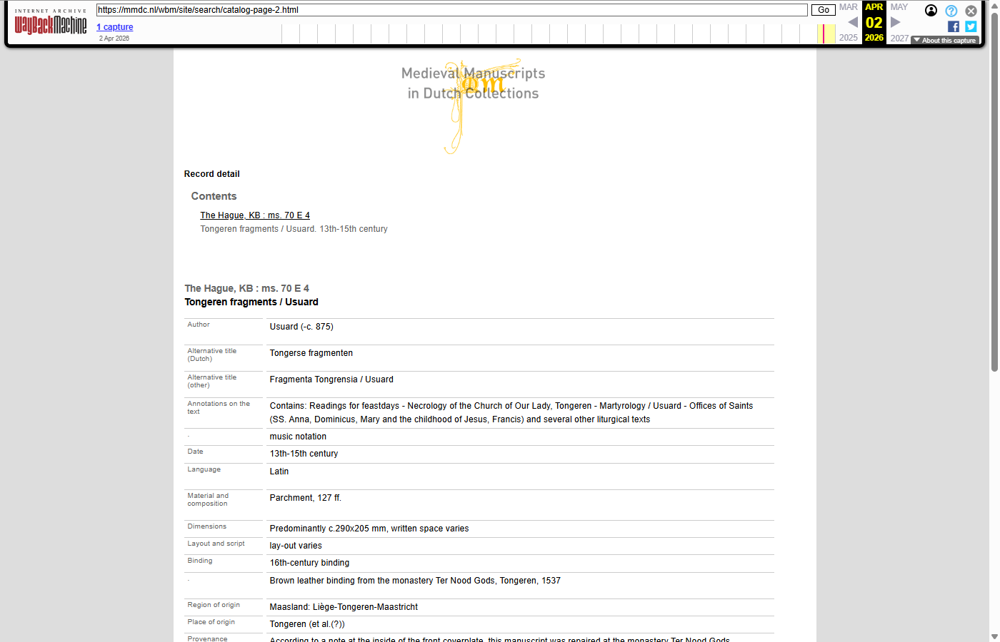</td>
  <td><strong>catalog-page-2: <em>Tongeren fragments / Usuard - The Hague, KB : ms. 70 E 4</em></strong><br/>
    <ul>
      <li>Original (defunct): <a href="https://mmdc.nl/static/site/search/detail.html?recordId=2#r2">https://mmdc.nl/static/site/search/detail.html?recordId=2#r2</a></li>
      <li>Wayback Machine (02-04-2026): <a href="https://web.archive.org/web/20260402123710/https://mmdc.nl/wbm/site/search/catalog-page-2.html">https://web.archive.org/web/20260402123710/https://mmdc.nl/wbm/site/search/catalog-page-2.html</a></li>
    </ul>
  </td>
</tr>
<tr>
  <td>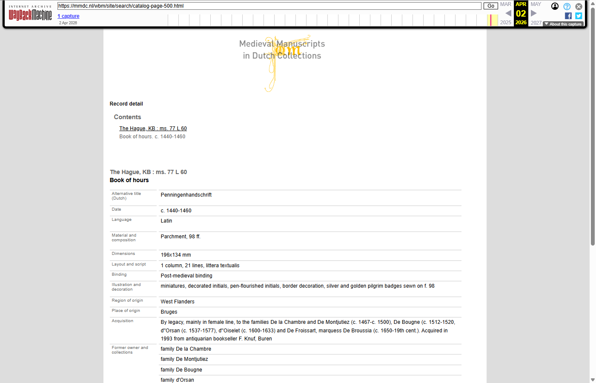</td>
  <td><strong>catalog-page-500: <em>Book of hours - The Hague, KB : ms. 77 L 60</em></strong><br/>
    <ul>
      <li>Original (defunct): <a href="https://mmdc.nl/static/site/search/detail.html?recordId=500#r500">https://mmdc.nl/static/site/search/detail.html?recordId=500#r500</a></li>
      <li>Wayback Machine (02-04-2026): <a href="https://web.archive.org/web/20260402222805/https://mmdc.nl/wbm/site/search/catalog-page-500.html">https://web.archive.org/web/20260402222805/https://mmdc.nl/wbm/site/search/catalog-page-500.html</a></li>
    </ul>
  </td>
</tr>
<tr>
  <td>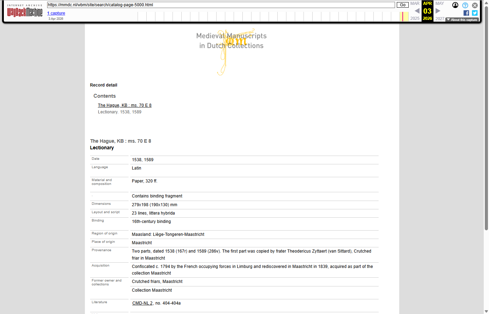</td>
  <td><strong>catalog-page-5000: <em>Lectionary - The Hague, KB : ms. 70 E 8</em></strong><br/>
    <ul>
      <li>Original (defunct): <a href="https://mmdc.nl/static/site/search/detail.html?recordId=5000#r5000">https://mmdc.nl/static/site/search/detail.html?recordId=5000#r5000</a></li>
      <li>Wayback Machine (03-04-2026): <a href="https://web.archive.org/web/20260403213400/https://mmdc.nl/wbm/site/search/catalog-page-5000.html">https://web.archive.org/web/20260403213400/https://mmdc.nl/wbm/site/search/catalog-page-5000.html</a></li>
    </ul>
  </td>
</tr>
</table>

## How mmdc.nl got into the Wayback Machine

### 1. Spidering the site

Because mmdc.nl is a JavaScript-rendered single-page application, a simple HTTP crawler could not discover all URLs. A custom spider was built, see the [`_spider-artifacts/`]({{ site.github.repository_url }}/blob/main/archived-sites/mmdc.nl/_spider-artifacts/) folder:

1. **[Seed URLs]({{ site.github.repository_url }}/blob/main/archived-sites/mmdc.nl/_spider-artifacts/input/seed-urls.txt)** - a manually composed list of top-level section pages (homepage, `/collections/`, `/highlights/`, `/literature/`, `/research_and_education/`, `/about/`, `/links/`).

2. **[Crawler]({{ site.github.repository_url }}/blob/main/archived-sites/mmdc.nl/_spider-artifacts/scripts/spider.py)** - Python + Crawlee with a headless browser, renders each page, extracts internal links, and classifies them by URL pattern (`SEARCH_CATALOG`, `HIGHLIGHTS`, `LITERATURE`, `COLLECTIONS`, `STATIC_ASSETS`, …) via [url_classifier.py]({{ site.github.repository_url }}/blob/main/archived-sites/mmdc.nl/_spider-artifacts/scripts/url_classifier.py).

3. **Catalog expansion** - search results were paginated and catalog IDs extracted using [extract_catalog_ids.py]({{ site.github.repository_url }}/blob/main/archived-sites/mmdc.nl/_spider-artifacts/scripts/extract_catalog_ids.py) and [generate_catalog_urls.py]({{ site.github.repository_url }}/blob/main/archived-sites/mmdc.nl/_spider-artifacts/scripts/generate_catalog_urls.py) to enumerate all **11.738** manuscript catalog records. PDF links were harvested separately using [extract_pdfs.py]({{ site.github.repository_url }}/blob/main/archived-sites/mmdc.nl/_spider-artifacts/scripts/extract_pdfs.py).

4. **Consolidation** - all discovered URLs were deduplicated and written to a single spreadsheet using [combine_all_urls.py]({{ site.github.repository_url }}/blob/main/archived-sites/mmdc.nl/_spider-artifacts/scripts/combine_all_urls.py) and [create_unified_excel.py]({{ site.github.repository_url }}/blob/main/archived-sites/mmdc.nl/_spider-artifacts/scripts/create_unified_excel.py), eventually resulting into the 'master' Excel [mmdc-urls-unified_15042026.xlsx](mmdc-urls-unified_15042026.xlsx).

Full planning notes are available in [PLAN-url-spider-mmdc.md]({{ site.github.repository_url }}/blob/main/archived-sites/mmdc.nl/_spider-artifacts/docs/PLAN-url-spider-mmdc.md).


### 2. Rendering the catalog pages

On the (by now defunct) live mmdc.nl site, every manuscript record lived behind a single URL of the form `https://mmdc.nl/static/site/search/detail.html?recordId={N}#r{N}`. The HTML at that URL contained almost no content: an empty `<div id="recordDetail">` shell plus a block of JavaScript that fetched the record data client-side and injected it into the DOM. As a result, a conventional crawler — and the Wayback Machine's Save Page Now robot — captured only the empty shell, not the manuscript description.

To work around this, a headless-browser rendering pipeline was built using Python and Playwright, implemented in [render_catalog_full.py]({{ site.github.repository_url }}/blob/main/archived-sites/mmdc.nl/_archiving-artifacts/scripts/render_catalog_full.py):

1. **Load each record in a real browser.** For every `recordId` in the unified URL list, Playwright opened the live page with `wait_until="networkidle"` and then explicitly waited for `#recordDetail` to become non-empty (up to 30 s), so that the client-side JavaScript had fully populated the record.

2. **Inline all CSS.** External stylesheets were walked via `document.styleSheets`, their rules serialised, and fetched `<link rel="stylesheet">` files downloaded over HTTP and concatenated. The resulting CSS was embedded in a single `<style>` block in the rendered file, so each page is a self-contained standalone HTML file with no external dependencies.

3. **Write a stable, flat filename.** Each page was saved as `catalog-page-{N}.html` under [`_archiving-artifacts/local-archive/catalog-pages/`]({{ site.github.repository_url }}/tree/main/archived-sites/mmdc.nl/_archiving-artifacts/local-archive/catalog-pages/), replacing the query-string URL (`/static/site/search/detail.html?recordId=N`) with a clean path-based one (`/wbm/site/search/catalog-page-N.html`) that the Wayback Machine could index cleanly.

4. **Resume, retry, log.** The pipeline checkpoints progress to a JSON file, retries transient failures up to three times, and logs any unrecoverable errors to another JSON file. This means the full 11.738-page run could be executed over several sessions without data loss.

The 11.738 rendered HTML files were then put on a temporary KB hosted webserver at `https://mmdc.nl/wbm/site/search/catalog-page-{N}.html` and submitted to the Wayback Machine in April 2026. This is why the catalog pages in the WBM captures above show the full record content instead of an empty shell.

### 3. Submitting to the Wayback Machine

Once the full URL list was known, the URLs were submitted to the Wayback Machine using the Internet Archive's [Save Page Now 2 (SPN2) API](https://web.archive.org/save) with authenticated access.

The submissions were done in two phases:

1. **Phase 1 — Non-catalog pages (Dec 2025):** 466 non-catalog URLs (317 static HTML pages, 112 PDFs and 38 images) were submitted on Dec 7-8, 2025 using [SaveToWBM_mmdc_non-catalog-pages.py]({{ site.github.repository_url }}/blob/main/archived-sites/mmdc.nl/_archiving-artifacts/scripts/SaveToWBM_mmdc_non-catalog-pages.py). Result: **466/466 (100%) successfully archived**.

2. **Phase 2 — Catalog pages (Apr 2026):** All 11.738 pre-rendered catalog pages were submitted Apr 2-11, 2026 using [SaveToWBM_mmdc_catalog-pages.py]({{ site.github.repository_url }}/blob/main/archived-sites/mmdc.nl/_archiving-artifacts/scripts/SaveToWBM_mmdc_catalog-pages.py). After an initial pass (11.658 successful) and a retry of the remaining 80, result: **11.738/11.738 (100%) indexed in the Wayback Machine**.

 Both scripts use concurrent connections (max 12), automatic retry on failure (up to 3 attempts), rate-limit handling, and checkpoint-based resume.

### 4. Local archive (on Github)

The rendered catalog pages are kept locally under [`_archiving-artifacts/local-archive/catalog-pages/`]({{ site.github.repository_url }}/tree/main/archived-sites/mmdc.nl/_archiving-artifacts/local-archive/catalog-pages/) as a second, independent preservation copy. Because of GitHub storage limits, only 10 (out of 11.738) sample pages have been uploaded to this folder (catalog-page-2, 10, 100, 500, 1000, 2005, 3001, 5000, 7000, 9000). 
The full set of 11.738 html files can be obtained from the Wayback Machine (using the [master Excel](mmdc-urls-unified_15042026.xlsx)), or via the KB (olaf.janssen@kb.nl).

Additionally, all static pages were rendered locally using [render_static_pages.py]({{ site.github.repository_url }}/blob/main/archived-sites/mmdc.nl/_archiving-artifacts/scripts/render_static_pages.py). These, together with all PDFs and images, have also been archived locally on GitHub:

* [`static-pages`]({{ site.github.repository_url }}/tree/main/archived-sites/mmdc.nl/_archiving-artifacts/local-archive/static-pages/) (318)
* [`pdfs`]({{ site.github.repository_url }}/tree/main/archived-sites/mmdc.nl/_archiving-artifacts/local-archive/pdfs/) (63)
* [`images`]({{ site.github.repository_url }}/tree/main/archived-sites/mmdc.nl/_archiving-artifacts/local-archive/images/) (38)

### 5. Lessons learned

For a detailed account of what went wrong, what we tried, and what we learned — including the JavaScript rendering problem, the rate limiting disaster, and reflections on human-AI collaboration — see the **[Lessons learned](lessons-learned.md)** page.

## Folder structure

```
mmdc.nl/
├── index.md                              # This page
├── lessons-learned.md                    # Lessons learned from this project
├── excel-details.md                      # Column-by-column breakdown of the Excel
├── mmdc-urls-unified_15042026.xlsx       # Master URL list with WBM status
├── images/                               # Screenshots used in docs
├── _spider-artifacts/                    # URL discovery (the spidering run)
│   ├── input/seed-urls.txt
│   ├── scripts/                          # spider.py, url_classifier.py, …
│   ├── docs/                             # PLAN-url-spider-mmdc.md, DISCOVERY-sru-api.md
│   └── runtime/                          # checkpoints, logs, storage
└── _archiving-artifacts/                 # WBM submission & local rendering
    ├── scripts/                          # 4 core Python scripts:
    │   ├── render_static_pages.py        #   render static pages to standalone HTML
    │   ├── render_catalog_full.py        #   render all 11.738 catalog pages to standalone HTML
    │   ├── SaveToWBM_mmdc_non-catalog-pages.py  # submit static pages to WBM
    │   └── SaveToWBM_mmdc_catalog-pages.py      # submit catalog pages to WBM
    ├── data/                             # JSON result files (progress, results)
    └── local-archive/                    # Full local site copy
        ├── static-pages/                 #   318 rendered static HTML pages
        ├── catalog-pages/                #   10 sample catalog pages (of 11.738)
        ├── pdfs/                         #   63 PDFs
        └── images/                       #   38 images
```

## Timeline

Dates reconstructed from the `WBM_Timestamp_submission` columns of the spreadsheet and from the surrounding session logs (all times UTC).

| Date | Activity | Output |
|------|----------|--------|
| 2025 (sporadic) | A handful of early WBM captures of individual pages (one each on 2025-01-20, 2025-04-29, 2025-05-14, 2025-09-17/18/19) | 7 static pages opportunistically in the Wayback Machine |
| Nov–early Dec 2025 | Site spidering with Python + Crawlee (headless browser), URL classification, catalog-ID enumeration, PDF harvesting | [mmdc-urls-unified_15042026.xlsx](mmdc-urls-unified_15042026.xlsx) — 317 static pages, 112 PDFs, 38 assets, 11.738 catalog record IDs |
| Dec 2025 | Rendering of all static pages to standalone HTML using [render_static_pages.py]({{ site.github.repository_url }}/blob/main/archived-sites/mmdc.nl/_archiving-artifacts/scripts/render_static_pages.py) | 318 rendered static HTML pages in `local-archive/static-pages/` |
| **2025-12-07 → 2025-12-08** | Mass WBM submission of all 466 non-catalog URLs (317 static pages, 112 PDFs, 38 images) via SPN2 API using [SaveToWBM_mmdc_non-catalog-pages.py]({{ site.github.repository_url }}/blob/main/archived-sites/mmdc.nl/_archiving-artifacts/scripts/SaveToWBM_mmdc_non-catalog-pages.py) | **429/429 (100%) successfully archived** |
| **2025-12-15** | mmdc.nl officially phased out; domain starts redirecting to the KB manuscripts landing page | Live site no longer available |
| Dec 2025 | PDFs and static asset images downloaded locally; 26 PDFs freshly indexed in WBM, 40 already had older captures | 112 PDFs + 38 images preserved locally |
| Late Dec 2025 – Mar 2026 | Headless-browser rendering of all 11.738 catalog records to self-contained HTML using [render_catalog_full.py]({{ site.github.repository_url }}/blob/main/archived-sites/mmdc.nl/_archiving-artifacts/scripts/render_catalog_full.py), with resume + retry across multiple sessions | 11.738 files in `local-archive/catalog-pages/catalog-page-{N}.html` |
| **2026-04-02 → 2026-04-07** | Sequential WBM submission of all 11.738 pre-rendered catalog pages using [SaveToWBM_mmdc_catalog-pages.py]({{ site.github.repository_url }}/blob/main/archived-sites/mmdc.nl/_archiving-artifacts/scripts/SaveToWBM_mmdc_catalog-pages.py) | ≈ 2.000–3.000 submissions/day, 11.658 successful on first pass |
| 2026-04-08 → 2026-04-10 | CDX-API verification of indexed captures; identification of 80 URLs that needed retry | Retry list compiled |
| **2026-04-11** | 34-minute retry pass for the remaining 80 catalog pages | **11.738/11.738 catalog pages indexed in the Wayback Machine** |
| **2026-04-15** | Unified spreadsheet exported with final WBM capture URLs and timestamps | [mmdc-urls-unified_15042026.xlsx](mmdc-urls-unified_15042026.xlsx) |

See also the [broader development timeline](../../how-this-site-was-built.md#april-2026-mmdcnl-catalog-pages-submitted-to-wbm) for day-by-day submission counts.

## Notes & known issues
 * The large local artifacts (11.738 rendered catalog pages in [`_archiving-artifacts/local-archive/catalog-pages/`]({{ site.github.repository_url }}/tree/main/archived-sites/mmdc.nl/_archiving-artifacts/local-archive/catalog-pages/) are kept outside GitHub because the total repo exceeds GitHub's 2 GB limit. 10 sample pages are included; the full set can be obtained from the Wayback Machine or via the KB (olaf.janssen@kb.nl).
