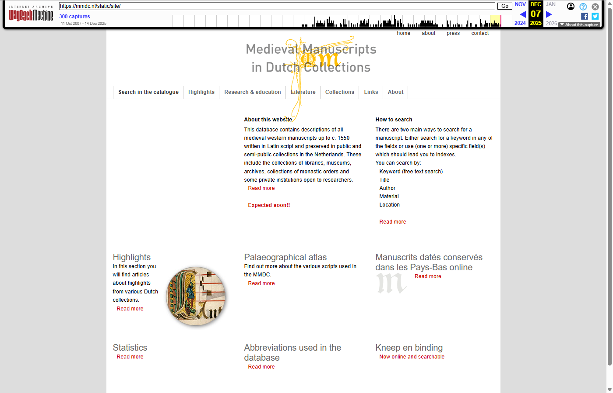
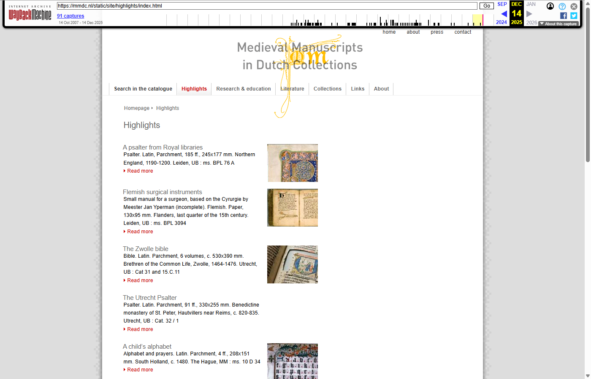
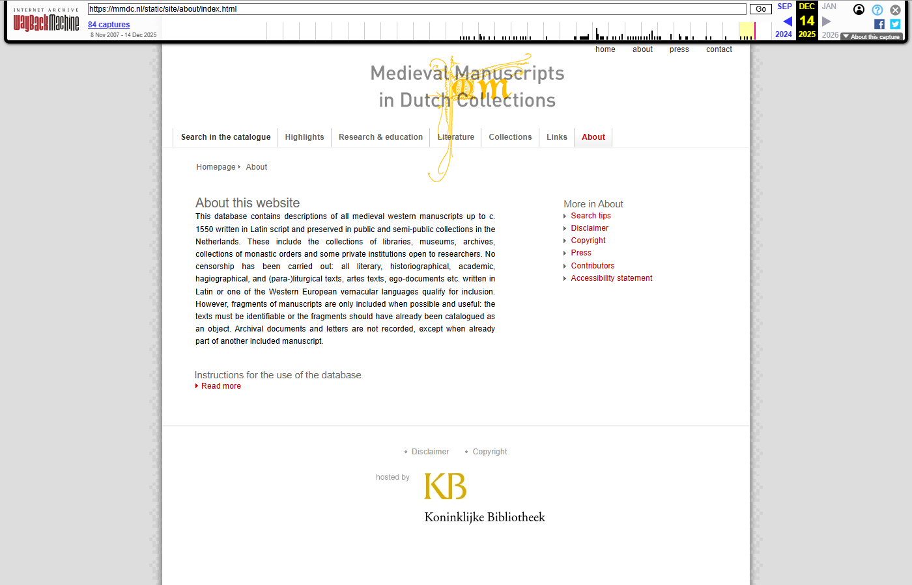

[← Back to Archived sites](../)

# Saving mmdc.nl to the Wayback Machine
*Latest update: 15-04-2026*

<br clear="all"/>

## About

[mmdc.nl](https://mmdc.nl/) — the **Medieval Manuscripts in Dutch Collections** of the KB, National Library of the Netherlands — was scheduled to be phased out on **15 December 2025**.

To preserve its content, its URLs (static pages, catalog records, PDFs and images) were submitted to [The Wayback Machine](https://web.archive.org/) (WBM) of The Internet Archive during **December 2025**. In addition, a full local rendering of the site was produced, because the catalog pages are JavaScript-rendered and the WBM capture alone does not always reproduce them faithfully.

## URL spreadsheet

The results are listed in [`mmdc-urls-unified_15042026.xlsx`](mmdc-urls-unified_15042026.xlsx). See the [URL spreadsheet page](url-spreadsheet.md) for a full description of the three sheets and every column.

## Before / after: original site vs. Wayback Machine capture

Each pair shows the live mmdc.nl page (left) and the same URL as captured in the Wayback Machine (right, with the WBM toolbar visible at the top).

### Homepage
| Original (defunct) | Wayback Machine |
|:------------------:|:---------------:|
|  |  |
| [`https://mmdc.nl/`](https://mmdc.nl/) | [WBM capture](https://web.archive.org/web/20251214093310/https://mmdc.nl/) |

### Collections
| Original (defunct) | Wayback Machine |
|:------------------:|:---------------:|
|  |  |
| [`https://mmdc.nl/static/site/collections/index.html`](https://mmdc.nl/static/site/collections/index.html) | [WBM capture](https://web.archive.org/web/20251214072708/https://mmdc.nl/static/site/collections/index.html) |

### Highlights
| Original (defunct) | Wayback Machine |
|:------------------:|:---------------:|
|  |  |
| [`https://mmdc.nl/static/site/highlights/index.html`](https://mmdc.nl/static/site/highlights/index.html) | [WBM capture](https://web.archive.org/web/20251214074859/https://mmdc.nl/static/site/highlights/index.html) |

### Literature
| Original (defunct) | Wayback Machine |
|:------------------:|:---------------:|
|  |  |
| [`https://mmdc.nl/static/site/literature/index.html`](https://mmdc.nl/static/site/literature/index.html) | [WBM capture](https://web.archive.org/web/20251214080033/https://mmdc.nl/static/site/literature/index.html) |

### Research & Education
| Original (defunct) | Wayback Machine |
|:------------------:|:---------------:|
|  |  |
| [`https://mmdc.nl/static/site/research_and_education/palaeography/index.html`](https://mmdc.nl/static/site/research_and_education/palaeography/index.html) | [WBM capture](https://web.archive.org/web/20251214082705/https://mmdc.nl/static/site/research_and_education/palaeography/index.html) |

### About
| Original (defunct) | Wayback Machine |
|:------------------:|:---------------:|
|  |  |
| [`https://mmdc.nl/static/site/about/index.html`](https://mmdc.nl/static/site/about/index.html) | [WBM capture](https://web.archive.org/web/20251214063529/https://mmdc.nl/static/site/about/index.html) |

## Catalog pages in the Wayback Machine

The 11,738 catalog (manuscript detail) records were JavaScript-rendered on the live site, so they were pre-rendered to static HTML and submitted to the Wayback Machine under the `/wbm/site/search/catalog-page-N.html` path. Because the original live pages were rendered client-side, no comparable "before" screenshot of the original URL could be captured — only the archived version is shown below.

| catalog-page-2 | catalog-page-500 | catalog-page-5000 |
|:--------------:|:----------------:|:-----------------:|
|  |  |  |
| *Tongeren fragments / Usuard* | *Book of hours* | *Lectionary* |
| Original (defunct): [`…detail.html?recordId=2`](https://mmdc.nl/static/site/search/detail.html?recordId=2#r2) | Original (defunct): [`…detail.html?recordId=500`](https://mmdc.nl/static/site/search/detail.html?recordId=500#r500) | Original (defunct): [`…detail.html?recordId=5000`](https://mmdc.nl/static/site/search/detail.html?recordId=5000#r5000) |
| [WBM capture](https://web.archive.org/web/20260402123710/https://mmdc.nl/wbm/site/search/catalog-page-2.html) | [WBM capture](https://web.archive.org/web/20260402222805/https://mmdc.nl/wbm/site/search/catalog-page-500.html) | [WBM capture](https://web.archive.org/web/20260403213400/https://mmdc.nl/wbm/site/search/catalog-page-5000.html) |

## Statistics

| Category | Count | Status |
|----------|------:|--------|
| Static HTML pages | 317 | Submitted to WBM, local copies exist |
| Catalog pages | 11,738 | Rendered locally (100%) |
| PDFs | 112 | 26 indexed in Dec 2025, 40 older only, 46 none |
| Static asset images | 38 | Downloaded locally |
| **Total WBM submissions** | **429** | Submitted, indexing verified |

## How the site was spidered

Because mmdc.nl is a JavaScript-rendered single-page application, a simple HTTP crawler could not discover all URLs. A custom spider was built in the `_spider-artifacts/` folder:

1. **Seed URLs** (`_spider-artifacts/input/seed-urls.txt`) — a handful of top-level section pages (homepage, `/collections/`, `/highlights/`, `/literature/`, `/research_and_education/`, `/about/`, `/links/`).
2. **Crawler** (`_spider-artifacts/scripts/spider.py`, Python + Crawlee with a headless browser) — renders each page, extracts internal links, and classifies them by URL pattern (`SEARCH_CATALOG`, `HIGHLIGHTS`, `LITERATURE`, `COLLECTIONS`, `STATIC_ASSETS`, …) via `url_classifier.py`.
3. **Catalog expansion** — search results were paginated and catalog IDs extracted (`extract_catalog_ids.py`, `generate_catalog_urls.py`) to enumerate all **11,738** manuscript records. PDF links were harvested separately (`extract_pdfs.py`).
4. **Consolidation** — all discovered URLs were deduplicated and written to a single spreadsheet (`combine_all_urls.py`, `create_unified_excel.py`), producing `mmdc-urls-unified_15042026.xlsx`.

Full planning notes are in [`_spider-artifacts/docs/PLAN-url-spider-mmdc.md`](_spider-artifacts/docs/PLAN-url-spider-mmdc.md).

## How the site was archived

Once the full URL list was known, the URLs were submitted to the Wayback Machine via the scripts in `scripts/wbm-archiver/` (top-level of this repo) and locally rendered copies were saved under `_archiving-artifacts/local-archive/`. Experiment notes on which WBM submission method worked best are in [`_archiving-artifacts/docs/EXPERIMENT-REPORT-wbm-methods.md`](_archiving-artifacts/docs/EXPERIMENT-REPORT-wbm-methods.md).

## Folder structure

```
mmdc.nl/
├── index.md                              # This page
├── README.md                             # GitHub-view version
├── images/                               # Screenshots used in docs
├── mmdc-urls-unified_15042026.xlsx       # Master URL list with WBM status
├── _spider-artifacts/                    # URL discovery (the spidering run)
│   ├── input/seed-urls.txt
│   ├── scripts/                          # spider.py, url_classifier.py, …
│   ├── docs/                             # PLAN-url-spider-mmdc.md, DISCOVERY-sru-api.md
│   └── runtime/                          # checkpoints, logs, storage
└── _archiving-artifacts/                 # WBM submission & local rendering
    ├── scripts/                          # Python archiving scripts
    ├── data/                             # JSON result files
    ├── docs/                             # Experiment reports, lessons learned
    ├── reports/                          # Run reports
    ├── screenshots/before|after/         # Comparison screenshots
    ├── local-archive/                    # Full local site copy
    └── warc/                             # WARC bundle (work in progress)
```

## Notes & known issues

- Two URLs have minor source-data issues: `…/AccessibilityStatement` (missing `.html`) and `…/index_Bifolium.pdx` (typo, should be `.pdf`).
- The large local artifacts (`_archiving-artifacts/local-archive/`, `warc/`, 11,738 rendered catalog pages) are kept outside GitHub because the total repo exceeds GitHub's 2 GB limit; long-term hosting via the Internet Archive is being arranged.