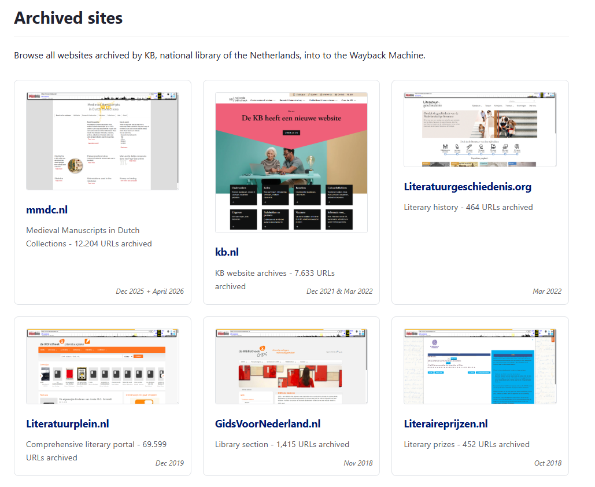

# Save KB websites to Wayback Machine

Scripts and data for archiving KB-managed websites to the Internet Archive's [Wayback Machine](https://web.archive.org/).

## Purpose

Some websites managed by the KB, national library of the Netherlands, have been discontinued over the past years. To preserve their content, eg. for Wikipedia sourcing and other cultural heritage purposes, the KB actively archives these websites into the Wayback Machine at [web.archive.org](https://web.archive.org).

---

## Browse archived sites
See the [overview of archived sites](archived-sites/). This page also gives access to the datasets of pages (URLs) archived in the Wayback Machine, available as Excel, TXT or CSV files.

---

## Scripts

The Python scripts used to archive websites into the Wayback Machine are documented in the [wbm-archiver-scripts](wbm-archiver-scripts/) section. These include:

* **General-purpose scripts** — interactive tools that read a list of URLs from a text file and submit them to the Wayback Machine (or retrieve existing archived versions). Built on the [waybackpy](https://pypi.org/project/waybackpy/) library. Suitable for any website.
* **mmdc.nl-specific scripts** — production scripts developed for the [mmdc.nl archiving project](archived-sites/mmdc.nl/), using the Internet Archive's SPN2 API with authenticated access, sequential submission, rate-limit handling, and checkpoint-based resume. Used to archive 12.204 URLs with a 100% success rate.
* **manuscripts.kb.nl-specific scripts** — spider and archiving scripts for the [manuscripts.kb.nl project](archived-sites/manuscripts.kb.nl/), including a breadth-first URL crawler, wiki-priority archiver, and bulk submission script. Used to archive 7.460 URLs with a 100% success rate.