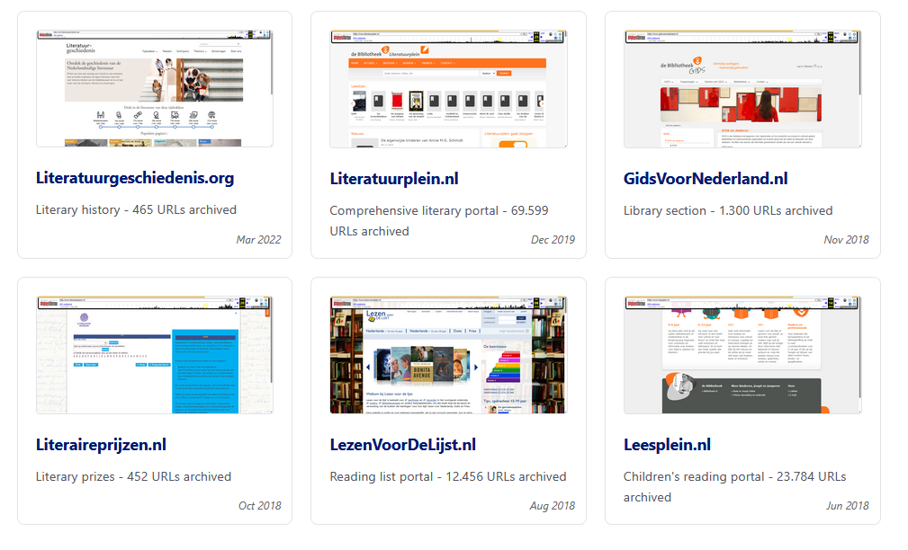
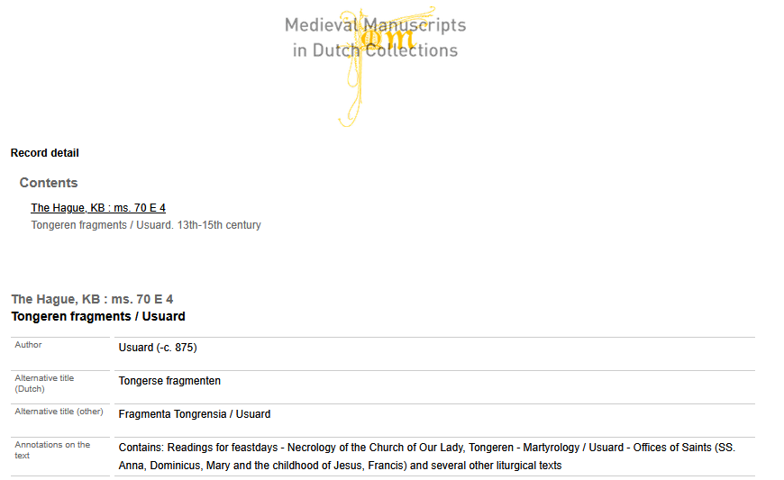

[← Back to Stories](./)

# Twee KB-websites met middeleeuwse handschriften opgenomen in de Wayback Machine, april 2026

*Op 15 december 2025 ging de stekker uit twee oudere KB-websites met middeleeuwse handschriften: manuscripts.kb.nl en mmdc.nl. Om dit digitaal erfgoed openbaar en toegankelijk te archiveren hebben we ze ondergebracht in de Wayback Machine van Internet Archive, in totaal bijna 20.000 pagina's. Het hele traject is uitgevoerd met hulp van een AI-assistent. Hieronder lees je het hele verhaal.*

*Olaf Janssen (KB), 30 april 2026*

--------------

Op 15 december 2025 trok de KB de stekker uit twee websites met middeleeuwse handschriften. **Middeleeuwse Verluchte Handschriften (manuscripts.kb.nl)** bevatte beschrijvingen, afbeeldingen en verluchtingen uit zo'n 400 manuscripten uit de collecties van de KB en [Huis van het Boek](https://www.huisvanhetboek.nl/), voorheen Museum Meermanno-Westreenianum.
**Medieval Manuscripts in Dutch Collections (mmdc.nl)** bevatte beschrijvingen van westerse middeleeuwse manuscripten tot circa 1550, geschreven in het Latijn of in een West-Europese volkstaal, bewaard in publieke en semipublieke collecties in Nederland.

Beide waren inhoudelijk verouderd en pasten niet meer in het huidige dienstenaanbod van de KB. Tijd om ze uit te faseren.

  
  

*Screenshots van de homepages van manuscripts.kb.nl (links) en mmdc.nl, kort voor de uitfasering op 15 december 2025.*

Maar er waren een paar problemen:

1. Er werd nog volop naar ze gelinkt. In onderzoekspublicaties, in catalogi van andere instellingen, op de Nederlandstalige Wikipedia, op Wikimedia Commons. Wie zo'n link na 15 december aanklikte, dreigde op op een 404 uit te komen. Geen manuscript, geen beschrijving, geen bron die iemand had geciteerd.
2. Er zijn nog geen volwaardig alternatieven voor beide diensten. Zo bevat [eCodicesNL nog niet alle 400 handschriften](https://db.ecodices.nl/search/eyJzZWFyY2h2YWx1ZXMiOltdLCJwYWdlIjoxLCJwYWdlX2xlbmd0aCI6MzAsInNvcnRvcmRlciI6InRpdGxlIn0=) van de KB en Huis van het Boek. En [collecties.kb.nl](https://collecties.kb.nl) is nog niet zover dat de KB (via IIIF) haar eigen handschriftverluchtingen aldaar kan tonen.
3. Niet iedereen kon zich vinden in de beslissing om deze sites offline te halen, omdat ze nog regelmatig gebruikt werden voor studie en onderzoek.

## Wayback Machine

Om toch een publiek toegankelijke plek te hebben waar (pagina's van) beide sites door de hele wereld nog geraadpleegd kunnen worden, bood de Wayback Machine (WBM) van Internet Archive uitkomst. Gelukkig hadden we al eerdere ervaring met het onderbrengen van uitgefaseerde KB-websites, of representatieve delen daarvan, in dit webarchief. Een kort overzicht van de archiveringsacties uit het verleden:

*Screenshot van KB-websites die in het verleden in de Wayback Machine zijn gearchiveerd, april 2026.*

- [kb.nl en collecties.kb.nl](https://kbnlresearch.github.io/SaveToWaybackMachine/archived-sites/kb.nl/23032022/) (huidige site, maart 2022)
- [Literatuurgeschiedenis.org](https://kbnlresearch.github.io/SaveToWaybackMachine/archived-sites/Literatuurgeschiedenis.org/) (maart 2022),
- [kb.nl](https://kbnlresearch.github.io/SaveToWaybackMachine/archived-sites/kb.nl/24122021/) (vorige versie site, dec 2021),
- [Literatuurplein.nl](https://kbnlresearch.github.io/SaveToWaybackMachine/archived-sites/Literatuurplein/) (dec 2019),
- [Gidsvoornederland.nl](https://kbnlresearch.github.io/SaveToWaybackMachine/archived-sites/GidsVoorNederland/) (nov 2018),
- [Literaireprijzen.nl](https://kbnlresearch.github.io/SaveToWaybackMachine/archived-sites/Literaireprijzen.nl/) (oct 2018),
- [Lezenvoordelijst.nl](https://kbnlresearch.github.io/SaveToWaybackMachine/archived-sites/LezenVoorDeLijst/) (aug 2018)
- [Leesplein.nl](https://kbnlresearch.github.io/SaveToWaybackMachine/archived-sites/Leesplein/) (jun 2018)

## We gebruikten AI

In de weken voor de uitschakeldatum hebben we beide sites in kaart gebracht (gespiderd, gecrawld) en alle URLs in twee grote Excel-lijsten gezet. Vervolgens hebben we alle URLs één voor één naar <https://web.archive.org/> gestuurd, waarna de webpagina gearchiveerd werd. Alles bij elkaar duurde dit een paar weken, de WBM is relatief traag met het archiveren van grote hoeveelheden URLs. En soms gingen dingen verkeerd en moesten dan opnieuw gedaan worden, wat zomaar weer een paar dagen extra doorlooptijd kon betekenen. Maar uiteindelijk is alles goed gekomen.

We hebben ons hierbij laten helpen door AI: Claude Code was niet alleen superhandig bij het schrijven van de benodigde plandocumenten, software en workflows, maar ook bij het uitvoeren hiervan, de algehele voortgangs-en procesbewaking en het na afloop controleren van de kwaliteit en integriteit van de resultaten was deze AI-assistent van onmisbare waarde. En laten we het schrijven van de bijbehorende [documentatie op Github](https://kbnlresearch.github.io/SaveToWaybackMachine/) niet vergeten, dankzij AI een degelijke en eenvoudige klus!

## manuscripts.kb.nl

Voor manuscripts.kb.nl ging het hele archiveerproces redelijk rechttoe rechtaan. Een [Python-spider](https://github.com/KBNLresearch/SaveToWaybackMachine/blob/main/archived-sites/manuscripts.kb.nl/_spider-artifacts/scripts/spider.py) liep alle [12.550 vindbare URL's](https://github.com/KBNLresearch/SaveToWaybackMachine/blob/main/archived-sites/manuscripts.kb.nl/_spider-artifacts/manuscripts-urls-spider-output.xlsx) af en filterde daaruit 7.460 unieke pagina's die het bewaren waard waren: de
[manuscriptbeschrijvingen](https://web.archive.org/web/20251213032801/https://manuscripts.kb.nl/show/manuscript/10+A+11), de [beeldgalerijen](https://web.archive.org/web/20251212054623/https://manuscripts.kb.nl/show/images_text/10+A+11), de [literatuurverwijzingen](https://web.archive.org/web/20251212164239/https://manuscripts.kb.nl/search/literature/10+A+11), de [inleidende teksten](https://web.archive.org/web/20251211005548/https://manuscripts.kb.nl/introduction). Deze werden vervolgens [met behulp van dit archiveerscript](https://github.com/KBNLresearch/SaveToWaybackMachine/blob/main/archived-sites/manuscripts.kb.nl/_archiving-artifacts/scripts/SaveToWBM_manuscripts_bulk.py) naar de WBM gestuurd. Eindstand: 7.460 op 7.460 succesvol gearchiveerd.

### Dataset

[Hier lees je het hele verhaal](https://kbnlresearch.github.io/SaveToWaybackMachine/archived-sites/manuscripts.kb.nl/). Onder het kopje "Results & URL spreadsheet" vind je een [dataset (Excel)](https://github.com/KBNLresearch/SaveToWaybackMachine/blob/main/archived-sites/manuscripts.kb.nl/manuscripts-urls-wbm-archived.xlsx) met daarin alle "voor-en-na" gearchiveerde URLs.

*Screenshot van [The Hague, MMW, 10 A 11](https://web.archive.org/web/20251212054623/https://manuscripts.kb.nl/show/images_text/10+A+11) in de Wayback Machine (dd. 12-12-2025)*

## mmdc.nl

Het archiveren van mmdc.nl verliep in twee fases. In december 2025 hebben we 466 statische pagina's, PDFs en afbeeldingen gearchiveerd. Daarbij kun je denken aan de [homepage](https://web.archive.org/web/20251207222812/https://mmdc.nl/static/site/), de [highlights](https://web.archive.org/web/20251214074859/https://mmdc.nl/static/site/highlights/index.html), [literatuurverwijzingen](https://web.archive.org/web/20251214080033/https://mmdc.nl/static/site/literature/index.html) of [nieuwsbrieven](https://web.archive.org/web/20251214061922/https://mmdc.nl/static/media/2/59/Bifolium_15_April%201990.pdf) over handschriften en oude drukken. Deze fase verliep soepel en vlot, rechttoe rechtaan webarchivering.

Maar voor de bijna 12.000 catalogusrecords - webpagina's met beschrijvende metadata van middeleeuwse handschriften, zie voorbeeld hieronder - ging het helaas wat minder soepel.

*Screenshot van een catalogusrecord in mmdc.nl. Hier zie je een aantal metadatavelden van "The Hague, KB : ms. 70 E 4 - Tongeren fragments / Usuard". Deze pagina was oorspronkelijk te vinden op <https://mmdc.nl/static/site/search/detail.html?recordId=2#r2> . (link werkt sinds 15-12-2025 niet meer).*

Deze pagina's lieten zich niet 123 archiveren in de WBM. Dit kwam doordat het inhoud met behulp van JavaScript dynamisch, in twee aparte stappen in de pagina geladen werd. Een menselijke bezoeker merkt daar bijna niets van, maar de robot van de Wayback Machine kon er niet mee overweg, die zag steeds een vrijwel lege pagina, dus zonder alle beschrijvende metadatavelden. Daar kun je [hier een voorbeeld van zien](https://web.archive.org/web/20251207194357/https://mmdc.nl/static/site/search/detail.html?recordId=2#r2).

We hebben dit in drie stappen opgelost, wederom met behulp van onze AI-assistent:

1. voor elke dynamische cataloguspagina hebben we m.b.v. [een stuk code](https://github.com/KBNLresearch/SaveToWaybackMachine/blob/main/archived-sites/mmdc.nl/_archiving-artifacts/scripts/render_catalog_full.py) een platte HTML-equivalent gemaakt, die ook alle vormgeving (CSS) en het mmdc-logo (als base64) lokaal in zich heeft. Je kunt hier [meer lezen over de gebruikte aanpak](https://kbnlresearch.github.io/SaveToWaybackMachine/archived-sites/mmdc.nl/#2-rendering-the-catalog-pages). Het resultaat was 11.738 volledig platte, 'self-contained' HTML-pagina's, waarvan je [hier een aantal voorbeelden](https://github.com/KBNLresearch/SaveToWaybackMachine/tree/main/archived-sites/mmdc.nl/_archiving-artifacts/local-archive/catalog-pages) kunt bekijken.
2. We hebben deze platte HTML-pagina's op een tijdelijke KB-webserver binnen het mmdc.nl-domein laten plaatsen. In plaats van de oorspronkelijke catalogus-URLs met syntax <https://mmdc.nl/static/site/search/detail.html?recordId={N}> waren de pagina's nou dus tijdelijk beschikbaar op <https://mmdc.nl/wbm/site/search/catalog-page-{N}.html>
3. Daarna hebben we deze bijna 12K pagina's [met behulp van dit archiveerscript](https://github.com/KBNLresearch/SaveToWaybackMachine/blob/main/archived-sites/mmdc.nl/_archiving-artifacts/scripts/SaveToWBM_mmdc_catalog-pages.py) door de Wayback Machine laten archiveren. Dit duurde wederom even, maar in april 2026 was uiteindelijk de hele catalogus gearchiveerd: 11.738 op 11.738 pagina's.

### Datasets

[Hier lees je het hele verhaal](https://kbnlresearch.github.io/SaveToWaybackMachine/archived-sites/mmdc.nl/). Onder het kopje "Results & URL spreadsheet" vind je een [dataset (Excel)](https://github.com/KBNLresearch/SaveToWaybackMachine/blob/main/archived-sites/mmdc.nl/mmdc-urls-unified_15042026.xlsx) met daarin alle "voor-en-na" gearchiveerde URLs. In het tabblad *[catalog-pages-full-metadata](https://kbnlresearch.github.io/SaveToWaybackMachine/archived-sites/mmdc.nl/excel-details.html#sheet-catalog-pages-full-metadata)* vind je ook de volledige mmdc-catalogus (11.738 records) als dataset.

*Screenshot d.d. 02-04-2026 van de in de Wayback Machine gearchiveerde pagina "The Hague, KB : ms. 70 E 4 - Tongeren fragments / Usuard". Deze is beschibaar op URL* [*https://web.archive.org/web/20260402123710/https://mmdc.nl/wbm/site/search/catalog-page-2.html*](https://web.archive.org/web/20260402123710/https://mmdc.nl/wbm/site/search/catalog-page-2.html)

## Overzichtje van relevante URLs

- [Saving manuscripts.kb.nl to the Wayback Machine](https://kbnlresearch.github.io/SaveToWaybackMachine/archived-sites/manuscripts.kb.nl/)
  - [Download dataset](https://github.com/KBNLresearch/SaveToWaybackMachine/blob/main/archived-sites/manuscripts.kb.nl/manuscripts-urls-wbm-archived.xlsx) (Excel)
- [Saving mmdc.nl to the Wayback Machine](https://kbnlresearch.github.io/SaveToWaybackMachine/archived-sites/mmdc.nl/)
  - [Download dataset](https://github.com/KBNLresearch/SaveToWaybackMachine/blob/main/archived-sites/mmdc.nl/mmdc-urls-unified_15042026.xlsx) (Excel)
- [Scripts and data for archiving KB-managed websites to the Internet Archive’s Wayback Machine](https://kbnlresearch.github.io/SaveToWaybackMachine/)
- Repo: <https://github.com/KBNLresearch/SaveToWaybackMachine/>